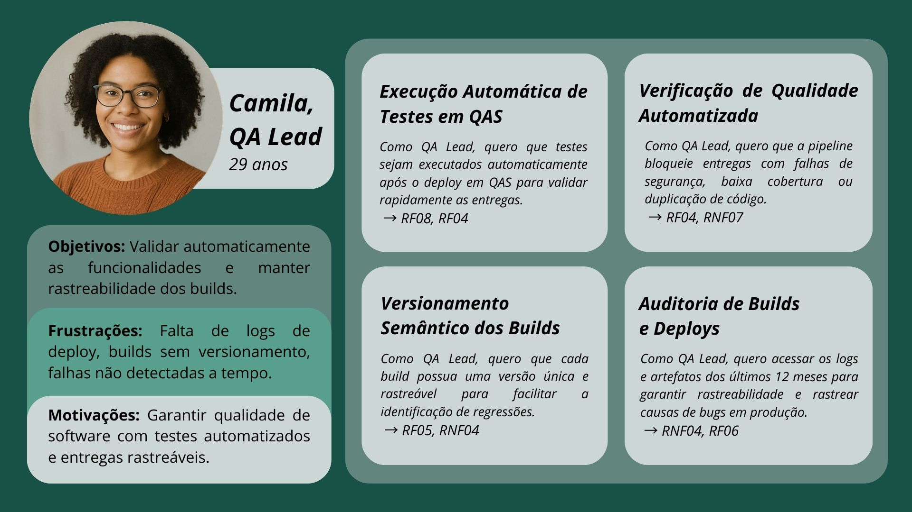

# Documentação da Esteira CI/CD
## Sumário

- [Documentação da Esteira CI/CD](#documentação-da-esteira-cicd)
- [1. Product Discovery](#1-product-discovery)
- [2. Levantamento de Requisitos e Arquitetura da Solução](#2-levantamento-de-requisitos-e-arquitetura-da-solução)
- [3. Políticas de Gestão de Configuração](#3-políticas-de-gestão-de-configuração)
- [4. Definição de Métricas](#4-definição-de-métricas)
- [5. Service Blueprint](#5-service-blueprint)
- [6. Configuração Esteira de CI](#6-configuração-esteira-de-ci)
- [7. Configuração da Esteira CD](#7-configuração-da-esteira-cd)
- [8. Coleta de Métricas](#8-coleta-de-métricas)
- [9. Catálogo de Serviços e Itens de Configuração (ICs)](#9-catálogo-de-serviços-e-itens-de-configuração-ics)
- [10.Design System](#10design-system)
- [11 Aplicação do Framework REACH](#11-aplicação-do-framework-reach)
- [12. Referências](#12-referências)

# 1. Product Discovery

## 1.1 Visão do Produto

&emsp; O produto a ser desenvolvido é uma esteira de CI/CD voltada para a plataforma Kino da empresa TimeNow. Trata-se de um sistema que automatiza os processos de integração e entrega contínua, com foco em garantir qualidade, segurança e eficiência no desenvolvimento do Kino. Este produto é uma ferramenta de suporte ao processo de desenvolvimento, voltada para validar código, garantir a segurança do ambiente, executar testes e automatizar o deploy de versões.

&emsp; O principal objetivo da esteira de CI/CD é automatizar e padronizar o processo de desenvolvimento, garantindo que as entregas da plataforma Kino sejam feitas de forma rápida, segura e com alta qualidade. Além disso, busca-se aumentar a confiabilidade das entregas através de validações automáticas e observabilidade contínua, reduzir o tempo de build e deploy, rastrear todas as entregas com versionamento estruturado e fornecer indicadores que apoiem a melhoria contínua dos processos.

&emsp; Para complementar a definição do produto, foi elaborada uma representação visual que organiza, de maneira clara, as principais características da esteira de CI/CD. A imagem está dividida em quatro quadrantes: É, Não é, Faz e Não faz. Cada seção descreve, respectivamente, o que o produto efetivamente é, o que não se propõe a ser, as funcionalidades que irá executar e aquelas que estão fora do seu escopo. Essa divisão facilita o entendimento dos limites e responsabilidades da solução, alinhando as expectativas do time de desenvolvimento e das partes interessadas.


&emsp;Além disso, para deixar mais explícito o objetivo do produto, foi elaborado um diagrama no modelo de visão de produto. Esse diagrama descreve o público-alvo, o problema que será resolvido, a natureza da solução, seus diferenciais e os principais benefícios esperados. Através dessa estrutura, é possível visualizar de forma rápida a proposta de valor da esteira de CI/CD para a plataforma Kino.


## 1.2 Brainstorming de funcionalidades

&emsp; O processo de definição das funcionalidades da esteira de CI/CD foi conduzido de maneira colaborativa, envolvendo diferentes stakeholders envolvidos no projeto para garantir uma visão plural e realista das necessidades da plataforma Kino. A discussão buscou equilibrar objetivos estratégicos do negócio com viabilidade técnica, segurança operacional e fluidez no processo de desenvolvimento. Abaixo, organizamos a perspectivas de Negócios e Técnica a fim de destacar o resultado da complementaridade das visões.

### 1.2.1 Negócios

&emsp; A esteira de CI/CD foi concebida com foco estratégico em maximizar o valor de negócio da plataforma Kino. Seu propósito é fortalecer o processo de entrega contínua com maior velocidade, confiabilidade e segurança, viabilizando uma cultura de desenvolvimento ágil e sustentável. A proposta busca alinhar a entrega técnica com os objetivos de negócio da TimeNow, promovendo redução de retrabalho, agilidade na liberação de funcionalidades e maior previsibilidade nas entregas. Além disso, a automação dos fluxos operacionais tem como foco liberar o time de desenvolvimento para atividades mais estratégicas, como inovação e evolução da plataforma.

&emsp; Dentre os principais objetivos de negócio mapeados, destacam-se:

- **Acelerar o time-to-market**, iniciando processos automaticamente desde a criação do Pull Request.

- **Garantir segurança nas entregas**, com gate manual para produção e rollback automático.

- **Aumentar a confiabilidade da plataforma**, com validações contínuas e processos padronizados.

- **Reduzir erros em produção**, por meio de testes automatizados e validações de segurança.

- **Fornecer visibilidade sobre o processo de entrega**, com indicadores como tempo de build/deploy e taxa de falhas.

- **Apoiar decisões de gestão técnica e estratégica**, com dados rastreáveis e métricas contínuas.

### 1.2.2 Revisão Técnica

&emsp; Do ponto de vista técnico, a esteira de CI/CD da plataforma Kino foi desenhada para ser robusta, automatizada e segura. A arquitetura prevê uma sequência bem definida de validações e ações automatizadas, com foco em minimizar erros humanos, garantir a consistência dos ambientes e monitorar a saúde das entregas de ponta a ponta.

&emsp; Foram avaliadas as principais necessidades para viabilizar a esteira de CI/CD, considerando práticas modernas de integração, entrega e observabilidade contínuas. A proposta envolve o uso de pipelines automatizados com validações desde o ambiente até a publicação de versões, priorizando segurança, rastreabilidade e escalabilidade do processo.

&emsp; Além disso, o design da solução considera princípios de DesignOps, promovendo uma experiência fluida para os times e facilitando a adoção do pipeline no dia a dia.

&emsp; Durante a revisão técnica, foram levantados os seguintes aspectos essenciais:

- **Padronização do ambiente de execução**: uso de ambientes controlados para evitar variações entre as etapas do processo.

- **Automação de validações técnicas**: garantia de que o código passe por checagens e verificações sem intervenção manual.

- **Segurança no fluxo de entrega**: práticas preventivas para reduzir vulnerabilidades e proteger os ambientes.

- **Rastreabilidade e controle**: mecanismos que permitam monitorar o histórico de entregas e identificar rapidamente qualquer anomalia.

- **Escalabilidade e manutenibilidade**: estrutura preparada para evoluções futuras e fácil manutenção pelo time técnico.

- **Adoção de princípios de DesignOps**: foco na experiência do time, com processos que apoiem a colaboração e a fluidez entre design, desenvolvimento e operação.

&emsp; Esses aspectos asseguram que o processo técnico da esteira esteja alinhado com as demandas do negócio, promovendo entregas seguras, eficientes e sustentáveis no longo prazo.

## 1.3 Funcionalidades

&emsp;As funcionalides de um sistema são elementos cruciais que contribuem para o funcionamento adequado e prático de uma aplicação ou software. Entretanto, para uma esteira inteligente, as funcionalidades não se dão especificamente às funções que existem no código de desenvolvimento, e sim aos processos que a mesma é capaz de fazer e executar no seu cotidiano operacional.

&emsp;Sendo assim, esse tópico separa em funcionalidades que envolvem CI - Continues Integration - e CD - Continues Deploy.

Funcionalidades da Esteira CI:

- Checkout do código: clonar o repositório da branch correta para execução da esteira.
- Validação de ambiente: garantir que variáveis e dependências estejam configuradas corretamente.
- Testes automatizados: executar testes de unidade e integração para garantir qualidade do código.
- Scan de segurança: análise estática do código (SAST) para detectar vulnerabilidades.
- Build do projeto: compilar o projeto e gerar o artefato para deploy.
- Versionamento: aplicar versão única ao artefato gerado (ex: semver ou com hash do commit).
- Métricas CI: coleta de indicadores como tempo de build, taxa de sucesso, volume de PRs.
- Notificações CI: informar time via e-mail, Teams ou Slack sobre sucesso ou falha do pipeline.
- Revisões com IA: uso de ferramentas de inteligência artificial para sugerir melhorias no código, identificar trechos problemáticos e revisar PRs automaticamente (ex: GitHub Copilot, CodeGuru, ReviewGPT).

Funcionalidades da Esteria CD:

- Download do artefato: buscar o artefato gerado pela esteira de CI no repositório (ex: Azure Artifacts).
- Aprovação manual: exigir aprovação humana para prosseguir com deploy em ambientes críticos.
  -Testes em QAS: executar testes de aceitação ou smoke tests automáticos em ambiente de qualidade.
- Verificação de observabilidade: checagem se logs, métricas e alertas estão funcionando corretamente.
- Deploy para produção: publicação automatizada da aplicação em ambiente produtivo.
- Rollback automático: reversão para versão anterior em caso de falha pós-deploy.
- Métricas CD: tempo de aprovação, número de deploys por semana, índice de sucesso.
- Notificações CD: comunicação de status do deploy em canais do time (Slack, e-mail, dashboards).

Ferramentas de auxílio:

- Azure DevOps: plataforma central para orquestração de pipelines CI/CD, gestão de artefatos, aprovações e métricas.
- GitHub ou GitLab: controle de versão e gatilho de pipelines via commits e pull requests.
- Docker: criação de ambientes consistentes para build e deploy.
- SonarQube: análise estática de código e monitoramento de dívida técnica e vulnerabilidades.
- Snyk ou Dependabot: detecção de vulnerabilidades em dependências.
- Application Insights (Azure): observabilidade e monitoramento de aplicação em tempo real.
- Slack / Teams: canais de comunicação com o time sobre o status da esteira.
- Terraform ou Bicep: infraestrutura como código para provisionamento automático e seguro dos ambientes.

## 1.4 Sequenciamento das funcionalidades

&emsp;Para que a esteira inteligente proposta seja funcional e facilmente implementada pelo time de desenvolvimento, é necessário que o sequenciamento das atividades esteja descrito de maneira clara, objetiva e operacional. Este sequenciamento permite entender a ordem correta dos eventos desde o momento do commit até a entrega final em produção, promovendo maior alinhamento, rastreabilidade e previsibilidade.

CI - Integração Contínua:

- Desenvolvedor realiza commit em branch de funcionalidade.
- Esteira é acionada automaticamente.
- Checkout do código.
- Validação de ambiente.
- Execução de testes automatizados.
- Análise estática de código (SAST).
- Revisões com IA.
- Build e geração do artefato.
- Versionamento do artefato.
- Coleta de métricas CI.
- Notificações ao time.

CD -  Deploy Contínuo:

- Esteira de CD é acionada após sucesso no build.
- Download do artefato.
- Testes em ambiente QAS.
- Validação de observabilidade.
- Aprovação manual.
- Deploy para produção.
- Rollback automático em caso de falha.
- Coleta de métricas CD.
- Notificações ao time.

&emsp;O sequenciamento apresentado garante uma execução ordenada, previsível e escalável das funcionalidades da esteira inteligente. Ele possibilita ao time técnico entender com clareza onde cada etapa acontece, o que precisa estar implementado em cada fase e quais ferramentas estão envolvidas. Isso facilita não apenas a implantação, mas também a manutenção e a evolução da esteira ao longo do tempo.

## 1.5 Canvas

O que é o MVP Canvas?

&emsp;O MVP Canvas (Minimum Viable Product Canvas) é uma ferramenta visual que ajuda empreendedores e equipes de produto a estruturarem e validarem uma ideia de negócio de forma rápida e enxuta. Ele é focado no desenvolvimento do Produto Mínimo Viável (MVP) - a versão mais simples de um produto que entrega valor ao cliente e permite obter feedback real do mercado com o menor esforço possível. O canvas é dividido em blocos que abordam aspectos essenciais como: problema, solução, proposta de valor, segmento de clientes, canais, métricas-chave, custos, e receitas esperadas. O objetivo é testar hipóteses, reduzir riscos e evitar desperdícios antes de investir em um produto completo.


&emsp;O MVP proposto busca aplicar e validar, em um contexto acadêmico e realista, uma esteira de CI/CD inteligente, automatizada e segura, promovendo o alinhamento entre as áreas de desenvolvimento, operações e segurança. Através de uma abordagem iterativa baseada em sprints, o time irá construir, testar e aprender com o uso de práticas modernas de DevOps, promovendo ganhos reais como agilidade, confiabilidade e rastreabilidade no processo de entrega de software.

## 1.6 Casos de Uso
&emsp; Os casos de uso descritos abaixo ilustram como os usuários interagem com a esteira de CI/CD da plataforma Kino. Cada cenário destaca a participação dos diferentes atores no processo de entrega contínua, desde a realização de commits até a aprovação manual de deploys, evidenciando como as funcionalidades do sistema são acionadas para garantir um fluxo eficiente, seguro e automatizado de desenvolvimento e operações.

### Caso de Uso 1: Commit e execução da Esteira de CI
**Ator**: Desenvolvedor.

**Objetivo**: Submeter código para validação automática.

#### Fluxo principal:

1. O desenvolvedor realiza um commit em uma branch de funcionalidade.

2. A esteira de CI é acionada automaticamente.

3. O sistema faz o checkout do código e valida o ambiente.

4. São executados testes automatizados e análise estática do código.

5. Se todas as validações forem bem-sucedidas, o artefato é gerado e versionado.

6. O time é notificado sobre o sucesso da CI.

#### Fluxo alternativo – Falha na CI:

1. Durante a análise, são detectadas falhas críticas no código.

2. O sistema interrompe o processo e notifica o desenvolvedor.

3. O desenvolvedor corrige os erros e realiza um novo commit, reiniciando o fluxo.


### Caso de Uso 2: Deploy Contínuo e Rollback automático
**Ator**: DevOps.

**Objetivo**: Aprovar manualmente o deploy em produção após validações automatizadas, garantindo a estabilidade e segurança do ambiente.

#### Fluxo principal:

1. Após o sucesso no build, a esteira de CD é acionada.

2. O artefato é implantado no ambiente QAS.

3. Testes são executados e as métricas de observabilidade são avaliadas.

4. Um responsável realiza a aprovação manual do deploy.

5. O sistema realiza o deploy em produção.

6. O time é notificado da nova versão em produção.

#### Fluxo alternativo – Rollback automático:

1. Durante ou após o deploy, são detectadas falhas críticas no ambiente de produção.

2. O sistema executa automaticamente um rollback para a versão anterior.

3. O time é notificado sobre o erro e a reversão realizada.


### Caso de Uso 3: Consulta de Métricas da Esteira
**Ator**: Líder técnico.

**Objetivo**: Acompanhar o desempenho da esteira de CI/CD para apoiar a tomada de decisão.

#### Fluxo principal:

1. O usuário acessa o dashboard de métricas da esteira CI/CD.

2. Visualiza indicadores como tempo médio de execução, taxa de sucesso, falhas recentes e outros dados relevantes.

3. Usa essas informações para identificar gargalos, tomar decisões estratégicas e propor melhorias.


## 1.7 Diagrama C4 Nível 1

&emsp; Este diagrama representa o contexto da Esteira CI/CD Inteligente, uma solução automatizada de integração e entrega contínua (CI/CD) voltada à orquestração eficiente do ciclo de vida de aplicações. Ele descreve as principais interações entre usuários, sistemas externos e o sistema central, com o objetivo de garantir entregas ágeis, seguras e auditáveis dentro do ambiente de desenvolvimento.


&emsp; Essa representação permite compreender não apenas o papel técnico do sistema, mas também sua importância organizacional como ponto de convergência entre desenvolvimento, qualidade, operações e segurança. Ao mapear essas conexões, o diagrama reforça a relevância de adotar práticas de CI/CD bem definidas e sustentadas por ferramentas modernas e processos automatizados.

# 2. Levantamento de Requisitos e Arquitetura da Solução

## 2.1 Requisitos funcionais (RFs)

&emsp; Os requisitos funcionais descrevem o que o sistema deve fazer e como ele deve se comportar. Eles são essenciais para garantir que o sistema atenda às necessidades dos usuários e cumpra suas funções de maneira eficaz.

&emsp; O requisitos a seguir foram desenvolvidos com base em user stories, que são descrições curtas e simples de uma funcionalidade do ponto de vista do usuário. Cada requisito funcional é acompanhado por uma descrição objetiva e critérios de aceitação, que definem as condições que devem ser atendidas para que o requisito seja considerado completo.

### RF01 – Implementação de Pipeline Automatizado de CI/CD
*Como* engenheiro de software, *quero* que o processo de integração e entrega seja automatizado *para* que cada alteração de código passe por validações contínuas até sua entrega final.

- **Descrição objetiva:** O projeto possui um fluxo CI/CD que automatiza build, validações, deploy, testes e rollback, permitindo entregas frequentes, seguras e auditáveis.

**Critérios de aceitação:**
  - Os pipelines deve ser acionado automaticamente em cada pull request.
  - Os pipelines devem incluir etapas para build, testes automatizados, análise de qualidade e deploy.
  - Os pipelines devem ser auditáveis, registrando cada etapa e resultado.

### RF02 – Pipeline de Entrega Contínua com Ambientes Separados
*Como* engenheiro de software, *quero* que o deploy seja automatizado para ambientes QAS e Produção *para* que o processo seja padronizado e confiável.

- **Descrição objetiva:** CD automatiza deploy em QAS (release) e Produção (main); cada ambiente tem validações e aprovações distintas.

**Critérios de aceitação:**
1.  O deploy em QAS deve ocorrer automaticamente via branch release.
2.  O deploy em Produção deve ocorrer automaticamente via branch main, após aprovação.
3. Ambientes distintos devem ter validações específicas (e.g., testes em QAS, aprovação manual em Produção).
4. As entregas devem ser registradas com logs em ambos os ambientes.

### RF03 – Proteção de Branch e Regras de Merge
*Como* engenheiro de software, *quero* que apenas códigos revisados e validados automaticamente possam ser integrados às branches principais *para* que o repositório permaneça íntegro e confiável.

- **Descrição objetiva:** Pull Requests direcionados às branches develop e main devem passar por validações automatizadas (build, testes e análise de qualidade) e, no mínimo, uma aprovação humana antes de serem integrados.

**Critérios de aceitação:**
1. As branches develop e main devem ser protegidas contra commits diretos.
2. Pull Requests direcionados às branches develop e main devem acionar build, testes e análise de qualidade.
3. O merge deve ocorrer apenas após aprovação de, no mínimo, uma pessoa.
4. O merge deve ser automático apenas se todas as validações forem bem-sucedidas.

### RF04 - Verificação de Qualidade de Software Automatizada
*Como* time de engenharia, *quero* que o código passe por verificações automáticas de qualidade *para* que apenas entregas consistentes avancem no processo.

- **Descrição objetiva:** O código deve ser submetido a análises estáticas e dinâmicas que validam padrões de qualidade, cobertura de testes, confiabilidade, segurança e aderência a boas práticas.

**Critérios de aceitação:**
1. A pipeline deve interromper a entrega se qualquer secret (token, senha, chave) for detectado no código.
2. O pipeline deve falhar em caso de vulnerabilidades classificadas como "alta" ou "crítica".
3. Código com alta duplicação deve gerar alerta ou bloqueio da entrega.
4. Builds com cobertura abaixo do limiar devem falhar ou alertar o time.
5. O processo não avança se dependências com CVEs críticos não forem resolvidas.
6. O processo não avança se não obter sucesso na aferição de métricas como complexidade ciclomática, acoplamento e cobertura de branches.
7. Os resultados das análises devem ser documentados e acessíveis ao time de desenvolvimento.
8. Ferramentas utilizadas devem ser integradas ao repositório e à esteira de CI/CD.
9. A análise deve ser executada automaticamente a cada Pull Request ou push em branches principais.

### RF05 – Versionamento Automático de Builds
*Como* equipe de QA e operação, *quero* que cada entrega tenha uma versão única *para* que possamos rastrear e identificar comportamentos de forma confiável.

- **Descrição objetiva:** Cada execução da esteira gera uma nova versão associada à entrega, facilitando rastreamento e auditoria.

**Critérios de aceitação:**
1. O versionamento deve seguir um padrão semântico.
2. Cada build deve gerar um identificador de versão único.
3. A versão deve estar acessível no artefato gerado e no histórico de deploy.
4. O sistema deve permitir rastrear facilmente qual versão está em cada ambiente.

### RF06 – Notificações Automatizadas no Fluxo de Entrega
*Como* time de desenvolvimento, *quero* ser notificado sobre o status das etapas da esteira *para* que possamos agir rapidamente em caso de falhas ou bloqueios.

- **Descrição objetiva:** O sistema de entrega envia notificações automáticas ao time conforme o progresso ou falhas da esteira.

**Critérios de aceitação:**
1. Notificações devem ser enviadas em eventos como: início, sucesso, falha ou rollback.
2.  O time de desenvolvimento deve receber as notificações em canais definidos (ex: Slack, Teams, e-mail).
3. Mensagens devem conter informações úteis (etapa, erro, link para logs).

### RF07 – Aprovação Manual em Etapas Críticas do Processo
*Como* responsável técnico, *quero* ter a possibilidade de aprovar manualmente certas entregas *para* que tenhamos controle adicional em momentos sensíveis.

- **Descrição objetiva:** Etapas específicas do fluxo exigem intervenção humana antes de seguir para a próxima fase, garantindo responsabilidade sobre entregas sensíveis.

**Critérios de aceitação:**
1. Algumas etapas do pipeline devem aguardar aprovação manual antes de seguir.
2. O aprovador deve ser notificado e poder visualizar logs e detalhes da entrega.
3. Sem aprovação, a esteira não pode prosseguir para a próxima fase.

### RF08 – Execução de Testes Automatizados em Ambiente QAS
*Como* equipe de QA, *quero* que o sistema execute testes automaticamente após o deploy em QAS *para* que seja possível validar o comportamento da aplicação.

- **Descrição objetiva:** O deploy em ambiente de homologação é seguido por testes automáticos que avaliam a funcionalidade e comportamento da entrega.

**Critérios de aceitação:**
1. Após o deploy em QAS, testes automatizados devem ser executados sem intervenção manual.
2. O resultado dos testes deve ser registrado e visível para a equipe de QA.
3. O deploy para Produção só pode ocorrer se os testes forem bem-sucedidos.

### RF09 – Execução de Testes de Carga Automatizados
*Como* responsável pela confiabilidade do sistema, *quero* submeter a aplicação a testes de carga *para* que possamos validar seu comportamento em cenários de alto uso.

- **Descrição objetiva:** O processo de entrega contempla a execução de testes de carga em ambiente controlado, avaliando consumo de recursos, tempo de resposta e estabilidade sob estresse.

**Critérios de aceitação:**
1. Os testes de carga são executados automaticamente como uma etapa do pipeline.
2. Devem simular cenários realistas com múltiplos usuários simultâneos, de acordo com as regras de negócio.
3. Métricas como tempo de resposta, uso de CPU/RAM e taxa de erro devem ser coletadas.
4. A esteira só prossegue para etapas seguintes (ex: produção) se os resultados estiverem dentro dos limites aceitáveis.
5. Relatórios dos testes devem estar disponíveis para consulta pela equipe técnica.

### RF10 – Capacidade de Rollback Automatizado
*Como* engenheiro de operação, *quero* poder reverter uma entrega em produção rapidamente *para* que o impacto ao usuário final seja minimizado.

- **Descrição objetiva:** O fluxo de entrega contempla a possibilidade de reverter automaticamente para uma versão anterior validada.

**Critérios de aceitação:**
- Em caso de falha, o sistema deve reverter para a última versão estável automaticamente.
-   O status da reversão deve ser registrado e comunicado ao time.


### RF11 – Execução de Testes de Recuperação de Falha (DR Test)
*Como* time técnico, *quero* simular falhas no fluxo de entrega *para* que possamos identificar gargalos e fortalecer a resiliência do sistema.

- **Descrição objetiva:** Simulações controladas de falhas são realizadas periodicamente no processo de entrega para avaliar capacidade de resposta e identificar pontos frágeis.

**Critérios de aceitação:**
1. O sistema deve permitir simulação de falhas controladas (ex: queda de serviço, timeout).
2. Deve haver monitoramento da resposta do sistema e tempo de recuperação.
3. Resultados devem ser documentados e discutidos para melhorias de resiliência.

## 2.2 Requisitos Não Funcionais (RNFs)

### RNF01 – Performance de Build


_Como_ integrante do time de desenvolvimento, _quero_ que os builds da pipeline sejam concluídos em **≤ 10 min** _para que_ eu receba feedback rápido sobre falhas.
- **Descrição objetiva:** tempo médio ≤ 10 min e P95 ≤ 15 min em 90 % das execuções.

**Critérios de Aceitação:**
1. Medição automática do tempo de build em cada execução.
2. Dashboard mostra tempo médio e P95.
3. Alertas disparam se build ultrapassar 12 min (threshold de alerta).

### RNF02 – Confiabilidade da Pipeline

_Como_ release manager, _quero_ que a pipeline tenha **SLA de 99,9 % de disponibilidade mensal** _para que_ os releases não fiquem bloqueados.
- **Descrição objetiva:** downtime ≤ 43 min/mês; MTTR < 5 min.

**Critérios de Aceitação:**
1. Monitoramento de disponibilidade via Health Check a cada 5 min.
2. Logs de incidentes e tempos de recuperação registrados automaticamente.
3. Relatório mensal de disponibilidade publicado no Confluence.

### RNF03 – Isolamento de Segurança

_Como_ responsável por segurança, _quero_ que cada job execute em **runner containerizado dedicado** _para que_ código mal-intencionado não afete outros pipelines.
- **Descrição objetiva:** 100 % dos jobs usam runners ephemeral; zero privilégios de host.

**Critérios de Aceitação:**
1. Catálogo de runners listando tipo “ephemeral” e sem mount de volume host.
2. Auditoria semanal confirma uso de runners isolados.
3. Falha na criação de runner privilegiado bloqueia pipeline.

### RNF04 – Auditoria & Rastreabilidade

_Como_ QA lead, _quero_ registros imutáveis de build e deploy _para que_ possamos rastrear qualquer versão em produção.
- **Descrição objetiva:** logs e artefatos retidos por 12 meses; hash SHA ligado ao commit Git e ticket Jira.

**Critérios de Aceitação:**
1. Armazenamento de artefatos e logs em bucket WORM (Write Once).
2. Metadados de build incluem SHA e ID de issue na tag.
3. Scripts de extração de logs retornam dados de até 12 meses.

### RNF05 – Escalabilidade

_Como_ DevOps engineer, _quero_ que a infraestrutura escale horizontalmente até **10 pipelines simultâneos** _para que_ picos de demanda não atrasem as entregas.
- **Descrição objetiva:** fila de jobs < 2 min em 95 % dos casos.

**Critérios de Aceitação:**
1. Teste de carga simula 10 pipelines paralelos e mede queue_time.
2. Queue_time P95 < 2 min em benchmark.
3. Alertas de autoscaling acionam quando fila > 3 jobs.

### RNF06 – Observabilidade

_Como_ SRE, _quero_ métricas de pipeline expostas no **Prometheus** _para que_ possamos monitorar falhas e latência em tempo real.
- **Descrição objetiva:** 100 % das execuções emitem métricas “status”, “duration”, “queue_time”.

**Critérios de Aceitação:**
1. Exporter envia métricas ao Prometheus em cada etapa.
2. Grafana dashboard exibe painel de status, duração e tempo de fila.
3. Alertas configurados para falha de job e latência acima de threshold.


### RNF07 – Manutenibilidade

_Como_ DevOps engineer, _quero_ os scripts de pipeline versionados em **repositório Git modular** _para que_ ajustes sejam simples e rastreáveis.
- **Descrição objetiva:** pipelines definidos como código YAML; revisões via pull request.

**Critérios de Aceitação:**
1. Todos os pipelines estão em arquivos YAML no repositório `infra/ci`.
2. Pull request obrigatório para qualquer mudança em .yml.
3. Proteção de branch `main` impede merge sem revisão.

### RNF08 – Conformidade & LGPD

_Como_ encarregado de compliance, _quero_ que nenhum artefato de build contenha dados pessoais _para que_ o processo atenda à LGPD.
- **Descrição objetiva:** verificação automática bloqueia artefatos com dados sensíveis; 0 incidentes de vazamento.

**Critérios de Aceitação:**
1. Scanner de conteúdo rastreia patterns de PII em artefatos.
2. Pipeline falha se PII detectado.
3. Relatório de conformidade gerado a cada build.

### RNF09 – Tempo de Rollback

_Como_ on-call engineer, _quero_ reverter um deploy malsucedido em **≤ 5 min** _para que_ impacto em produção seja mínimo.
- **Descrição objetiva:** pipeline CD possui estágio `rollback`; RTO ≤ 5 min validado em DR drill trimestral.

**Critérios de Aceitação:**
1. Comando `rollback` documentado e automatizado no pipeline.
2. Simulação de rollback concluída em < 5 min no DR drill.
3. Logs de rollback armazenam timestamp de início e fim.

# 3. Políticas de Gestão de Configuração

&emsp; A gestão de configuração é um processo essencial para manter a consistência, rastreabilidade e qualidade do software ao longo do seu ciclo de vida. Este documento define as políticas adotadas pelo grupo para organização do fluxo de trabalho no repositório, padronização de nomes de branches, controle de pushs, revisão de código por pares e validação da integridade do código. As diretrizes aqui estabelecidas têm como objetivo facilitar a colaboração entre os membros da equipe, reduzir erros e garantir um desenvolvimento eficiente, coeso e confiável.

## 3.1 Fluxo de Trabalho de Repositório

&emsp; Adotamos o modelo de **Git Flow simplificado**, adaptado para produtividade e controle. As branches principais são:

- `main`: branch estável com código pronto para produção.  
- `dev`: branch de integração contínua. Reúne os desenvolvimentos das features antes de serem integrados na `main`.

Branches auxiliares:
- `feature/*`: novas funcionalidades.  
- `fix/*`: correções de bugs.  
- `hotfix/*`: correções urgentes em produção.  
- `chore/*`: tarefas de manutenção (ex: atualização de dependências).

**Exemplo de criação de branch:**
```bash
git checkout -b feature/login-page
```

### 3.1.1 Padrões para Nomes de Branches

Os nomes de branches devem seguir o padrão:
```
<tipo>/<descricao-curta>
```

Tipos válidos:
- `feature` – Novas funcionalidades
- `fix` – Correção de bugs
- `hotfix` – Correções emergenciais
- `chore` – Tarefas técnicas/melhoria interna

Exemplos:
- `feature/adicionar-cadastro`
- `fix/erro-login`
- `hotfix/fix-token-expirado`
- `chore/atualizar-eslint`

### 3.1.2 Políticas de Push

- Commits diretos na `main` são proibidos.
- Commits só são permitidos via Pull Request (PR), com aprovação mínima de um revisor.
- Todo push para a `main` exige aprovação e validação automatizada de testes via CI.

Comando recomendado:
```bash
git push origin feature/minha-feature
```

### 3.1.3 Revisão de Código por Pares (Code Review)

&emsp; Antes de qualquer merge, o código deve ser revisado por pelo menos 1 membro do time.

**Critérios de Revisão:**
- O código está legível, limpo e com boas práticas?
- A funcionalidade está clara e testada?
- Não há código morto/comentado?
- Há cobertura adequada por testes automatizados?

**Processo:**
1. Criar Pull Request para a branch `dev` ou `main`.
2. Atribuir pelo menos um revisor.
3. Corrigir pontos levantados na revisão.
4. Merge somente após todas as aprovações.

### 3.1.4 Padronização e Convenções

Todos os commits devem seguir o padrão convencional:
```
<tipo>: <mensagem curta>
```

Tipos aceitos:
- `feat`
- `fix`
- `chore`
- `docs`
- `style`
- `refactor`
- `test`

Exemplos:
- `feat: adicionar autenticação com JWT`
- `fix: corrigir bug na tela de login`


&emsp; As políticas descritas neste documento servem como base para a organização e controle das configurações do projeto, promovendo boas práticas de desenvolvimento, padronização e colaboração eficaz entre os integrantes do grupo.

&emsp; O cumprimento dessas diretrizes é fundamental para garantir a qualidade do código, facilitar o versionamento e permitir uma evolução contínua e estruturada do projeto. Estas normas estão sujeitas a revisão conforme as necessidades da equipe e do projeto evoluírem.

# 4. Definição de Métricas

&emsp; A definição de métricas é um componente essencial para o gerenciamento eficaz de projetos de engenharia de software, sobretudo quando se trata da implantação de um fluxo de entrega contínua (CI/CD).

&emsp; A mensuração sistemática do desempenho permite não apenas acompanhar a evolução das atividades da equipe, como também identificar gargalos de produtividade, 
pontos de falha no processo e oportunidades concretas de melhoria. Por meio de métricas bem estabelecidas, é possível analisar o desempenho técnico da solução, a estabilidade das entregas e a resiliência do processo frente a mudanças e incidentes. 

&emsp; Além disso, o uso consistente de métricas contribui para o fortalecimento de uma cultura organizacional baseada em dados, o que favorece a transparência nas decisões e o aprendizado coletivo. Esse tipo de abordagem torna-se ainda mais relevante em contextos colaborativos, como o do projeto desenvolvido com a Timenow Engenharia, onde a integração entre as expectativas da empresa parceira e os processos internos da equipe do Inteli é essencial para o sucesso da entrega.

&emsp; Dessa forma, essa seção tem como objetivo formalizar as métricas que serão acompanhadas ao longo do projeto. Essas métricas foram selecionadas de maneira criteriosa com base em frameworks reconhecidos internacionalmente, visando capturar os aspectos mais relevantes da performance técnica, da qualidade do produto, da segurança das entregas e da maturidade organizacional da equipe. A proposta aqui apresentada procura, portanto, alinhar rigor técnico com aplicabilidade prática, contribuindo para uma entrega mais eficaz, segura e contínua.

## 4.1 Frameworks para Definição de Métricas

&emsp; A escolha das métricas a serem monitoradas no projeto é guiada por três frameworks complementares, amplamente reconhecidos na comunidade de DevOps: **DORA Metrics, Accelerate Metrics e o Framework CALMS**. Cada um desses modelos contribui com uma perspectiva específica que, somadas, oferecem uma abordagem holística para a medição da performance da equipee da eficácia do fluxo de trabalho.

### 4.1.1 DORA Metrics
&emsp; O **DORA Metrics**, desenvolvido a partir das pesquisas do grupo DevOps Research and Assessment, é o mais amplamente utilizado para mensuração de desempenho técnico em times de desenvolvimento. Ele foca em quatro métricas-chave que refletem diretamente a eficiência e a estabilidade da entrega de software. Essas métricas são utilizadas como benchmark global e têm forte correlação com os resultados organizacionais.  

### 4.1.2 Accelerate Metrics
&emsp; O **Accelerate Metrics**, por sua vez, deriva das evidências apresentadas no livro "Accelerate", que aprofunda a discussão sobre a relação entre práticas de engenharia e resultados de negócio. Esse framework amplia o escopo do DORA ao incluir aspectos como qualidade do software, cobertura de testes automatizados, segurança e aspectos culturais como a 
autonomia das equipes.

### 4.1.3 CALMS (Culture, Automation, Lean, Measurement, Sharing)

&emsp; Já o Framework **CALMS (Culture, Automation, Lean, Measurement, Sharing)** apresenta uma abordagem qualitativa para avaliação da maturidade DevOps de uma organização. Ao observar dimensões como cultura colaborativa, práticas de automação, pensamento enxuto, capacidade de medição e compartilhamento de conhecimento, o CALMS permite mapear lacunas e orientar ações de melhoria contínua que vão além dos indicadores numéricos.

&emsp; A integração dos três frameworks possibilita que as métricas selecionadas capturem não apenas a dimensão operacional do projeto, mas também sua sustentabilidade cultural e estratégica.

## 4.2 Seleção de Métricas

&emsp; As métricas foram organizadas em categorias, com base nos frameworks apresentados. Cada métrica 
selecionada foi avaliada quanto à sua relevância no contexto do projeto, à possibilidade de coleta automatizada e à capacidade de fornecer insights práticos para o aperfeiçoamento do processo.

### 4.2.1 Métricas DORA

- **Lead Time for Changes:** Representa o tempo médio entre a submissão de uma alteração no código (commit) e sua efetiva liberação em ambiente de produção. Quanto menor esse tempo, maior a agilidade do time em entregar valor ao usuário. Essa
métrica reflete a eficiência do fluxo de desenvolvimento e validação.

- **Deployment Frequency:** Mede o número de vezes que o código é implantado em produção em um determinado período. A alta frequência de deploys está associada à capacidade da equipe de realizar entregas incrementais e reduzir riscos por meio de
ciclos curtos e contínuos.

- **Change Failure Rate:** Indica a porcentagem de alterações em produção que causam falhas, exigindo rollback ou correções urgentes. Esse indicador está diretamente ligado à estabilidade da entrega e à confiabilidade da pipeline de integração e
testes.

- **Mean Time to Recovery (MTTR):** Refere-se ao tempo médio necessário para restaurar um serviço após uma falha. Essa métrica mede a resiliência do sistema e a capacidade da equipe de agir rapidamente em cenários de instabilidade.

### 4.2.2 Métricas Accelerate

- **Cobertura de Testes Automatizados:** Expressa a proporção do código coberto por testes automatizados. Alta cobertura
indica maior previsibilidade e segurança nas mudanças, reduzindo a chance de regressões em funcionalidades já implementadas.
 
- **Tempo médio de build:** Avalia o tempo necessário para compilar e empacotar o código a cada execução da pipeline. Tem
impacto direto no tempo de resposta do time e na agilidade do ciclo de feedback.

- **Segurança das Entregas:** Está relacionada à presença de verificações automáticas de vulnerabilidades e práticas seguras de versionamento, como uso de dependências confiáveis e escaneamento de código.

- **Qualidade percebida pela equipe:** Coletada por meio de autoavaliações e questionários qualitativos, essa métrica permite acompanhar o sentimento da equipe em relação à qualidade do produto entregue e à eficácia dos processos internos.

### 4.2.3 Indicadores CALMS

- **Culture (Cultura):** Envolve a observação da segurança psicológica entre os membros da equipe, da abertura para feedback e da colaboração entre diferentes papéis técnicos e de negócio.

- **Automation (Automação):** Mede o grau de automação nos processos-chave como testes, builds, deploys e monitoramento. Quanto maior a automação, menor o esforço manual e o risco de erros operacionais.

- **Lean (Enxuto):** Avalia a eficiência do fluxo de valor por meio de indicadores como tempo de ciclo, eliminação de retrabalho e foco nas entregas que realmente agregam valor ao usuário final.

- **Measurement (Medição):** Diz respeito à regularidade e à confiabilidade da coleta, análise e uso das métricas pela equipe. Inclui a capacidade de visualizar dados e agir com base neles.

- **Sharing (Compartilhamento):** Relaciona-se à prática de disseminar aprendizados, documentar retrospectivas e promover a transparência nas decisões técnicas e estratégicas.

&emsp;Esses indicadores qualitativos serão coletados por meio de entrevistas estruturadas, formulários de autoavaliação e observação das cerimônias do time (como dailies, reviews e retrospectivas), compondo uma visão complementar
às métricas quantitativas descritas anteriormente.

# 5 Service Blueprint
## 5.1 Personas e Users Stories
&emsp; A criação de personas e user stories é uma prática essencial no desenvolvimento de software centrado no usuário. Personas são representações fictícias de usuários reais, baseadas em dados qualitativos e quantitativos que descrevem seus perfis, necessidades, objetivos, frustrações e comportamentos. Elas ajudam equipes de produto, design e engenharia a tomar decisões mais assertivas, mantendo o foco no valor entregue ao usuário final [5]. No contexto deste projeto, que envolve a implementação de uma esteira CI/CD robusta e confiável, mapear personas permite compreender as diferentes visões dos profissionais envolvidos — como DevOps e QA — e alinhar as funcionalidades às suas reais expectativas.

&emsp; As user stories são descrições curtas de funcionalidades sob a perspectiva do usuário. Cada user story segue geralmente o formato “Como [persona], quero [ação] para [benefício]”, conectando diretamente as funcionalidades do sistema às necessidades do usuário [6]. Elas são fundamentais para descrever requisitos funcionais e não funcionais de forma clara, priorizável e facilmente compreensível por todas as partes envolvidas no projeto. No caso deste projeto, as user stories foram fundamentais para estruturar funcionalidades como deploy automatizado, rollback, testes automáticos e auditoria — garantindo que o sistema atenda às expectativas reais dos stakeholders técnicos [7].

&emsp; A Persona 1, Rafael, representa o perfil de um engenheiro DevOps experiente, com 32 anos, que trabalha em uma empresa de médio porte. Rafael busca automatizar o fluxo de integração e entrega contínua para evitar erros manuais, reduzir o tempo de resposta a falhas e melhorar a rastreabilidade do processo. Suas frustrações incluem builds lentos, instabilidades nas pipelines e riscos associados a deploys manuais. Suas user stories refletem essas dores, com foco em CI/CD automatizado (RF01, RF02, RNF01), rollback automático em produção (RF10, RNF09), ambientes segregados (RF02, RF08, RNF05) e monitoramento em tempo real com Prometheus (RNF06). Mapeá-lo como persona garante que o projeto considere requisitos críticos de confiabilidade e eficiência operacional.


&emsp; Já Camila, a Persona 2, é uma QA Lead de 29 anos em uma empresa de engenharia. Seu principal objetivo é garantir qualidade e rastreabilidade nas entregas, com foco em automação de testes e versionamento confiável dos builds. Ela se frustra com a falta de visibilidade sobre o que é entregue, builds não rastreáveis e a ausência de alertas preventivos. Suas user stories tratam da execução automática de testes em QAS (RF08, RF04), verificação de qualidade automatizada (RF04, RNF07), versionamento semântico dos builds (RF05, RNF04) e auditoria dos artefatos (RNF04, RF06). Com isso, a inclusão de Camila como persona assegura que as entregas do projeto também atendam às expectativas de qualidade, conformidade e rastreabilidade — aspectos vitais para o sucesso do pipeline em ambientes produtivos.



## 5.2 Jornada do Usuário
&emsp; A jornada do usuário é uma ferramenta de design centrado no usuário que descreve, de forma sequencial, as etapas pelas quais uma persona passa ao interagir com uma solução, serviço ou sistema. Ela ajuda a visualizar ações, emoções, pontos de contato e frustrações, permitindo uma compreensão mais profunda da experiência do usuário ao longo do tempo.

&emsp; No contexto deste projeto, que visa a construção de uma esteira de CI/CD automatizada, segura e rastreável, o mapeamento da jornada foi realizado com base nas personas criadas previamente (Rafael e Camila). Ambas representam usuários técnicos essenciais para o sucesso da solução: um engenheiro DevOps e uma líder de QA. Suas respectivas jornadas foram analisadas desde a identificação do problema até a adoção da solução em produção, permitindo compreender tanto os cenários reais enfrentados quanto os benefícios esperados com a implementação da esteira.

&emsp; Abaixo está a jornada de usuário do Rafael, engenheiro DevOps experiente que busca maior eficiência, rastreabilidade e confiabilidade no processo de deploy. Sua jornada evidencia o impacto da automação e do rollback em sua rotina, desde a identificação dos problemas até a operação em produção.


&emsp; Abaixo está a jornada de usuário da Camila, líder de QA com foco em qualidade, versionamento e visibilidade dos builds. Sua experiência ressalta a importância da automação de testes, auditoria e validação contínua no ciclo de vida da entrega de software.


### 5.2.1 Justificativa Metodológica
&emsp; O mapeamento da jornada do usuário foi adotado por ser uma abordagem consolidada no design de experiências e desenvolvimento de soluções centradas no usuário. A ferramenta permite alinhar diferentes perspectivas (como DevOps e QA) e facilita a visualização de gaps entre o que o sistema oferece e o que o usuário espera, permitindo decisões orientadas por contexto real.

&emsp; Neste projeto, a escolha por representar duas jornadas separadas — uma para cada persona — se deu pelo fato de que Camila e Rafael possuem funções, objetivos e frustrações distintas na interação com a esteira de CI/CD. Essa separação ajuda a refinar requisitos técnicos e priorizar entregas conforme a perspectiva de cada stakeholder.

&emsp; A jornada foi estruturada com base em um modelo clássico de *Customer Journey Map*, com etapas como descoberta, uso, validação e operação, e inclui elementos como **ações, pontos de contato, emoções e pontos de dor**.

&emsp; A construção da jornada do usuário neste projeto foi essencial para garantir que a esteira de CI/CD não fosse apenas tecnicamente robusta, mas também realmente útil e aderente às necessidades práticas dos usuários envolvidos. O mapeamento contribuiu para direcionar as funcionalidades-chave, como automação de testes, rollback e monitoramento, a partir da visão de quem opera e valida as entregas.

## 5.3 Service Blueprint

&emsp; O service blueprint é uma ferramenta visual utilizada para mapear, de forma detalhada, todos os pontos de contato, processos de suporte, fluxos e ferramentas envolvidos na entrega de um serviço. Ele permite enxergar não só o que o usuário vê, mas também os bastidores, facilitando a identificação de gargalos, oportunidades de melhoria e alinhamento entre equipes. No contexto da consultoria Timenow, o blueprint foi aplicado para desenhar a esteira de Integração Contínua (CI), detalhando como as demandas de software percorrem desde a concepção até a entrega em produção, utilizando o Azure DevOps como principal plataforma de gestão.


legenda:
**preto**: tecnologias de backstagea actions
**marrom**: POs, QAs e pessoas de negócios
**azul**: desenvolvedores

### Fluxo das Etapas da Esteira de CI
&emsp; O processo inicia com a criação e definição de requisitos, onde o PO e outros responsáveis de negócios registram épicos e as user stories relacionadas no Azure DevOps. Esse registro é fundamental para garantir rastreabilidade e clareza sobre o que será desenvolvido.

&emsp; Em seguida, ocorre a análise e aceitação das user stories. Nessa etapa, as histórias são avaliadas quanto à clareza, viabilidade e alinhamento com os objetivos do negócio. Caso não sejam aceitas, o fluxo retorna para a redefinição das user stories, promovendo um ciclo iterativo de refinamento. Se aceitas, o processo avança.

&emsp; Com as user stories aprovadas, parte-se para a definição de tarefas. Aqui, as tasks são detalhadas no Azure DevOps, o que dispara a validação do ambiente local e a criação de uma branch específica para cada tarefa no repositório. Essa divisão clara de tarefas e ambientes garante organização e controle sobre o que está sendo desenvolvido.

&emsp; A etapa de implementação é quando o desenvolvedor atua diretamente no código, realiza o push para a branch criada e abre um Pull Request (PR). O PR é o gatilho para o pipeline de validação para UAT que consiste em etapas a fim de verificar a consistencia e qualidade no código. Após validação na CI, ocorre o code review, momento em que outros membros da equipe avaliam a qualidade do código e correta implementação das regras de negócio.

Após o code review, o fluxo segue para testes e homologação. O pipeline automatizado executa o deploy da branch para o ambiente de UAT (User Acceptance Testing), onde a implementação é validada. Se houver problemas, retorna-se à implementação para ajustes; se aprovado, o processo segue.

&emsp;É importante ressaltar que, a  pipeline está configurada para interromper a execução automaticamente caso alguma etapa não seja concluída com sucesso. Isso garante maior controle de qualidade e evita que códigos com falhas avancem no processo. No entanto, o SonarQube (Sprint 4) está temporariamente inativo na pipeline, sendo necessária a sua reativação futura para retomada completa da análise estática de código. Além disso, quando todas as etapas da pipeline são concluídas com sucesso, incluindo os testes de integração, é gerado automaticamente um relatório com os resultados das execuções. Esse relatório pode ser configurado e visualizado diretamente no dashboard do Azure DevOps, facilitando o acompanhamento da saúde do projeto e das entregas.

*Integração do SonarQube com a Esteira de CI*

&emsp;O SonarQube foi configurado e está em execução dentro de uma Máquina Virtual (VM) hospedada na Azure, com o objetivo de fornecer uma análise estática de código automatizada durante a execução da esteira de CI. A escolha por uma VM dedicada garante maior controle sobre o ambiente de execução, permite escalabilidade e facilita o gerenciamento da ferramenta. O endereço da VM onde o SonarQube está hospedado é: http://172.191.167.26. Esse endpoint é acessível pela pipeline durante a validação do código, permitindo que a análise de qualidade seja feita automaticamente a cada execução de Pull Request ou merge para branches relevantes.

&emsp;Essa integração garante que a esteira de CI possa "bater" diretamente no endpoint do SonarQube, submetendo o código-fonte para análise. A ferramenta então avalia diversos critérios, como duplicação de código, cobertura de testes, vulnerabilidades e code smells, retornando um relatório com o status da qualidade do código. Com essa arquitetura, a análise do SonarQube torna-se parte do ciclo de validação contínua, promovendo práticas de desenvolvimento mais robustas, transparentes e aderentes aos padrões de qualidade definidos pela equipe.

&emsp; Por fim, na etapa de produção e finalização, ocorre o merge da branch para a main, execução do pipeline de produção e deploy final. A user story é marcada como concluída e são coletadas métricas para análise posterior, fechando o ciclo de melhoria contínua.

1) Pipeline: Branch → UAT
**Objetivo**:
&emsp; Validar a qualidade, integridade e segurança do código submetido antes de disponibilizá-lo para validação funcional no ambiente UAT.

**Etapas**:
- Validação do Ambiente Local

- Build da Aplicação

- Testes Unitários

- Testes de Integração

- Lint: valida boas práticas e estiloz de formatação 

- Validação Estática de Código: SonarQube para detectar bugs, code smells e vulnerabilidades com base na análise do código-fonte. 

- Validação Dinâmica de Código: Execução da aplicação em sandbox para capturar erros em tempo de execução (ex: memory leaks, exceções não tratadas, violações de segurança).

- Scan de Segurança: Verificação de vulnerabilidades conhecidas em bibliotecas e pacotes (npm audit, OWASP Dependency Check, Snyk, etc.), Também análise de permissões indevidas, exposições de segredos, etc.

- Deploy para UAT: Aplicação é implantada em ambiente de homologação (UAT), espelhando produção. Também mantém a versão registrada e rastreável.

2) Pipeline: UAT → Produção
**Objetivo**:
&emsp; Promover código validado funcionalmente para o ambiente de produção, com segurança e testes finais.

**Etapas**:
- Validação do Ambiente Local

- Build da Aplicação

- Testes de Integração

- Testes End-to-End (E2E): Simulam a jornada completa do usuário, testando desde o frontend até o backend. Ferramentas comuns: Cypress, Selenium, Playwright.

- Scan de Segurança

- Deploy em Produção: Aplicação é implantada em ambiente de produção após sua funcionalidade ser testada por usuários ideais. Também mantém a versão registrada e rastreável.


2) Pipeline UAT -> produção:


#### Processos de Suporte e Ferramentas Utilizadas
&emsp; Durante todo o fluxo, o Azure DevOps é a principal ferramenta de suporte, sendo utilizado para registro de épicos, user stories, tasks, controle de branches, PRs e execução dos pipelines de CI/CD. Além disso, ferramentas de versionamento (como Git), ambientes de homologação e produção, e sistemas de coleta de métricas complementam o ecossistema, garantindo rastreabilidade, automação e visibilidade do processo.

## Conclusão
&emsp; A análise do service blueprint foi essencial para mapear de forma clara e objetiva todo o fluxo da esteira de CI na Timenow. O diagrama facilitou a visualização das responsabilidades de cada papel, destacou as interações entre POs, QAs e desenvolvedores, e evidenciou como as ferramentas e processos se conectam. Com isso, podemos garantir entregas mais eficientes e organizadas.

# 6. Configuração Esteira de CI
A seguir, serão apresentados os tópicos referentes à configuração da esteira de Integração Contínua (CI). Serão abordadas as principais etapas necessárias para sua implementação e como cada uma agrega para garantir automação, consistência e agilidade no processo de desenvolvimento.

## 6.1 Configuração do Repositório

## 6.2 Configuração dos hooks
&emsp; Os hooks são scripts que permitem executar ações automáticas em resposta a eventos específicos no repositório. Eles são fundamentais para garantir que certas verificações e processos sejam realizados antes ou depois de determinadas ações, como commits ou pushes. A configuração correta dos hooks é essencial para manter a qualidade do código, impedindo que alterações indesejadas sejam feitas no repositório remoto sem a devida validação.

&emsp; No contexto deste projeto, os hooks serão utilizados para garantir que as regras de qualidade e segurança sejam aplicadas antes que o código seja integrado ao repositório principal. Isso inclui a execução de testes unitários automatizados, verificação de estilo de código (lint) e validação de dependências. A configuração desses hooks foi feita com a utilização do Husky, uma ferramenta que facilita o gerenciamento deles, permitindo definir quais scripts devem ser executados.

### 6.2.1 Configuração do pre-commit
&emsp; O hook `pre-commit` é acionado antes de um commit ser realizado, momento em que faz verificações e validações para garantir que apenas alterações que atendam aos critérios pré-definidos sejam registradas. 

**Etapa de lint**

&emsp; Uma das etapas configuradas no pre-commit é a execução do `lint`, que verifica o estilo e a formatação do código. O lint é uma ferramenta que analisa o código-fonte em busca de inconsistências com os padrões definidos, como erros de sintaxe e formatação inadequada. Esse processo ajuda a manter a qualidade do código e manutenibilidade, garantindo a padronização entre todos os desenvolvedores que trabalham no projeto.

&emsp; O código da Timenow utiliza a linguagem Python e, dessa forma, a ferramenta de lint que foi configurada no projeto é o flake8. Essa ferramenta combina outras três (pyflakes, pycodestyle, mccabe) para conseguir ter maior precisão ao detectar erros, verificar a conformidade com o PEP 8 e a complexidade ciclomática.

&emsp; A nível de artefato, foi realizada a configuração do flake8, mas a implementação no hook do pré-commit foi desenvolvida utilizando o ESLint, a ferramenta de lint para JavaScript. O teste da implementação foi feito com base em um arquivo JS criado para simular o código do projeto, sendo uma maneira mais simples de realizar a prova de conceito, visto que alterações precisariam ser realizadas no código do projeto para que o flake8 fosse aplicado com sucesso.

### 6.2.2 Configuração do pre-push

&emsp;O hook pre-push tem o objetivo de interceptar o processo de envio (git push) para garantir que o código atenda aos padrões mínimos de qualidade, segurança e funcionalidade antes de ser integrado ao repositório e acionar a esteira CI/CD. Essa pipeline atua como uma primeira "barreira" de proteção à qualidade da base de código e ajuda a evitar falhas óbvias logo no início do processo. Sendo assim, as etapas executadas no pré-push são:

- Execução de testes unitários (no momento, configurado para testar nossa função Js com Jest).
- Verificação de mensagem de commit válida (padrão Conventional Commits)

Execução da ferramenta Synk

- snyk test: varredura de vulnerabilidades nas dependências do projeto.
- snyk code test: análise estática do código em busca de falhas de segurança.
- snyk monitor: envio de um snapshot do estado atual para acompanhamento contínuo na plataforma Snyk.

&emsp;As análises do Snyk notificam sobre problemas, mas não bloqueiam o push, permitindo visibilidade sem interromper o fluxo de desenvolvimento.

&emsp;Caso uma dessas etapas não passem, o push é bloqueado. 
&emsp;Na imagem a seguir, observa-se a execução do script commit-msg, que valida o formato do commit, seguida da execução dos testes unitários. Ao final do processo, por configuração da própria esteira e das políticas do repositório na Azure, é bloqueado o push direto na branch principal (main ou master), reforçando a segurança da pipeline.


*pre-push*

``` bash
#!/bin/sh
. "$(dirname "$0")/_/husky.sh"

echo "Executando testes com Jest..."
npm test || exit 1

echo "Executando Snyk test..."
npx snyk test || echo "⚠️  Vulnerabilidades encontradas pelo snyk test (mas push liberado)"

echo "Executando Snyk code test..."
npx snyk code test || echo "⚠️  Problemas no código detectados pelo snyk code test (mas push liberado)"

echo "Enviando snapshot para o Snyk Monitor..."
npx snyk monitor || exit 1

```
&emsp;Essa configuração de hooks garante uma camada inicial de controle de qualidade no processo de versionamento, promovendo maior confiabilidade no pipeline de CI/CD e reforçando a disciplina de boas práticas no time de desenvolvimento. Com isso, problemas simples são evitados logo no início, reduzindo retrabalho e aumentando a estabilidade das entregas.

## 6.3 Configuração da pipeline

### 6.4 Etapa de checkout e build
A etapa de **build** tem como objetivo compilar e empacotar a aplicação em uma imagem Docker. Essa imagem é o artefato principal a ser utilizado nos estágios seguintes da esteira CI/CD, como testes e deploy. Ela garante que o código submetido possa ser executado de forma consistente e isolada em qualquer ambiente. O estágio `Build` no Azure DevOps é responsável por agrupar os passos de compilação da imagem. Ele é executado por um agente `ubuntu-latest`, que provê um ambiente limpo, efêmero e com ferramentas essenciais já instaladas — incluindo o Docker Engine e CLI. A construção da imagem é feita com a task `Docker@2`, configurada com o comando `build`. Ela consome o `Dockerfile` localizado na raiz do repositório (`$(Build.SourcesDirectory)/Dockerfile`) e gera uma imagem baseada nas instruções declaradas ali.
```yaml
- task: Docker@2
  inputs:
    command: build
    dockerfile: '$(Build.SourcesDirectory)/Dockerfile'
    tags: |
      $(Build.BuildId)
```
A imagem é automaticamente versionada com a variável `$(Build.BuildId)`, que representa o identificador único do build. Isso assegura rastreabilidade e evita conflitos entre versões.

**Saídas esperadas**
A saída do estágio é uma imagem Docker compilada e tagueada com o ID do build. Caso um push para um registro de contêiner seja configurado posteriormente, essa imagem poderá ser reutilizada em ambientes de QAS ou produção.

**Ferramentas envolvidas**

* **Azure DevOps Pipelines** – Orquestra o fluxo de CI.
* **Ubuntu-latest** – Agente de execução com Docker pré-instalado.
* **Docker\@2** – Task para construir a imagem Docker.
* **Dockerfile** – Define o ambiente e comandos de construção da aplicação.

### 6.5 Etapa de lint

### 6.5 Etapa de testes automatizados
&emsp; A etapa de testes automatizados tem como objetivo validar o comportamento correto da aplicação antes que ela avance para ambientes posteriores no ciclo de desenvolvimento. Essa etapa garante que o código submetido esteja de acordo com as regras de negócio e que alterações não introduzam efeitos colaterais indesejados.

Existem dois tipos principais de testes automatizados nesta pipeline:

**Testes unitários:** verificam o comportamento isolado de funções ou classes.

**Testes de integração:** testam a colaboração entre diferentes componentes da aplicação, simulando cenários mais próximos do uso real.

A execução automatizada desses testes acontece na esteira de integração contínua (CI), orquestrada pelo Azure DevOps Pipelines. O estágio responsável por essa tarefa é o Test, descrito abaixo.

#### Stage Test – Execução dos testes de integração
O estágio Test é executado por um agente ubuntu-latest, que oferece um ambiente efêmero com as ferramentas necessárias pré-instaladas. O fluxo desse stage é dividido em três passos principais:

1) Definição do ambiente Node.js
A versão 20.x do Node é provisionada com a task NodeTool@0.

2) Instalação de dependências
O comando npm install é utilizado para preparar o ambiente de testes com todas as dependências listadas no package.json.

3) Execução dos testes de integração
O script npm run test:integration é disparado, sendo esse script responsável por rodar os testes de integração definidos no projeto.


```
.yml
- stage: Test
  displayName: Run Tests
  jobs:
  - job: IntegrationTests
    displayName: Run Integration Tests
    pool:
      vmImage: ubuntu-latest
    steps:
    - task: NodeTool@0
      inputs:
        versionSpec: '20.x'
      displayName: 'Use Node.js'

    - script: |
        echo "Instalando dependências..."
        npm install
      displayName: 'Install dependencies'

    - script: |
        echo "Rodando testes de integração..."
        npm run test:integration
      displayName: 'Run integration tests'
```

**Exemplos de Testes Unitários**
#### HelloWorld

- Classe testada: HelloWorld

- Objetivo: Verificar se o método hello() retorna corretamente a saudação personalizada com o nome do usuário.

```
.ts
test('Teste Hello deve retornar o nome do usuário', () => {
  const helloworld = new HelloWorld('Luigi');
  expect(helloworld.hello()).toBe('Hello world, Luigi');
});
```

&emsp; Esse teste isola a lógica de saudação da classe HelloWorld e assegura que o comportamento esperado seja mantido independentemente de outras partes do sistema.

**Exemplos de Testes de Integração**
#### Calculus + Potentiation

- Classes testadas: Calculus, Potentiation

- Objetivo: Validar a integração entre as duas classes no cálculo do volume de um cubo.

Os cenários cobertos incluem:

- Integração direta com Potentiation: garante o uso correto do método powerOfThree().

- Vários tamanhos de cubo: valida o retorno para diferentes inputs.

- Valores decimais: assegura precisão em operações com ponto flutuante.

- Valores inválidos: verifica o tratamento de inputs negativos ou zero.

- Instanciação de dependências: garante que a classe Potentiation é utilizada corretamente.

- Casos de borda: analisa a resposta para valores muito pequenos.

- Consistência: compara execuções repetidas.

- Simulação de falhas: testa como o sistema reage quando Potentiation falha.

```
.ts
test('should properly integrate with Potentiation to calculate cube volume', () => {
  const sideLength = 4;
  const directResult = new Potentiation().powerOfThree(sideLength);
  const calculus = new Calculus();
  const calculusResult = calculus.calculateBoxVolume(sideLength);
  expect(calculusResult).toBe(directResult);
  expect(calculusResult).toBe(64);
});
```

#### Ferramentas envolvidas
- Azure DevOps Pipelines – Orquestra os estágios de CI e executa os testes.
- Ubuntu-latest – Imagem de agente que provê o ambiente com Node.js e utilitários.
- Node.js – Runtime utilizado para rodar os testes e scripts npm.
- npm / Jest – Gerenciador de pacotes e test runner utilizados para executar os testes definidos no projeto.

&emsp; A etapa de testes automatizados garante que o código validado na esteira CI esteja funcional e livre de erros críticos antes de ser promovido. Testes unitários asseguram a corretude de cada componente individualmente, enquanto os testes de integração verificam se os módulos interagem de maneira consistente. Sua execução contínua no pipeline evita regressões e contribui para a entrega de software confiável.

# 7. Configuração da Esteira CD
A esteira de Entrega Contínua (CD) é responsável por automatizar o processo de deploy da aplicação em ambientes de produção, garantindo que as versões mais recentes do código sejam disponibilizadas de forma rápida e sempre garantindo a qualidade do produto final.

## 7.1 Metodologias de deploy
&emsp; As metodologias são maneiras de realizar o deploy de uma aplicação em produção, cada uma com suas características, vantagens e desvantagens. No contexto do projeto, foram estudadas duas metodologias de deploy: Blue-Green Deployment e Canary Releases. 

&emsp; A Blue-Green Deployment consiste em utilizar duas versões idênticas do ambiente de produção (blue e green). A nova versão é implantada no ambiente inativo (green) enquanto o ambiente ativo (blue) continua recebendo tráfego. Após a validação das funcionalidades no ambiente green, o tráfego é redirecionado para ele, minimizando riscos e garantindo rollback rápido em caso de problemas, já que o ambiente blue permanece intacto. Ao realizar o deploy dessa maneira, não há downtime, já que o tráfego é redirecionado instantaneamente entre os ambientes, garantindo alta disponibilidade. 

&emsp; O Canary Release consiste em disponibilizar a nova versão de um sistema apenas para uma parcela dos usuários, aumentando gradualmente o tráfego direcionado a ela. Essa abordagem permite monitorar o comportamento da nova versão em produção com dados reais, ajudando a minimizar riscos e identificar problemas rapidamente. Caso sejam detectados problemas, é possível reverter o tráfego para a versão anterior sem causar impacto significativo para a maioria dos usuários.

&emsp; Nesse contexto, o processo de desenvolvimento contínuo está sendo estudado para abranger 3 ambientes: desenvolvimento, staging e produção. O ambiente de desenvolvimento será utilizado para testes locais, enquanto o ambiente de staging servirá como pré-produção, onde serão realizados testes mais rigorosos antes do deploy final em produção. A produção será o ambiente final, onde a aplicação estará disponível para os usuários.

&emsp; Os passos contidos na esteira de CD ocorrerão logo após a conclusão do processo de CI e a aprovação manual. Além disso, serão realizadas análises dinâmicas (DAST), que consistem em testar a aplicação em tempo de execução, simulando ataques externos para identificar vulnerabilidades de segurança.

### 7.1.1 Deploy com Canary Release

Como mencionado na seção anterior, o Canary Release é uma metodologia de deploy que permite lançar novas versões de software para um subconjunto de usuários antes de disponibilizá-las para todos. Essa abordagem reduz riscos, pois possibilita monitorar o desempenho e a estabilidade da nova versão em um ambiente real, com dados reais, antes de um lançamento completo.

Ao estudar as estratégias de deploy, o grupo optou por implementar o Canary Release como a metodologia para a esteira de CD. Essa escolha se baseou na necessidade de garantir uma transição suave entre as versões, sendo posível escolher as segmentações, minimizando o impacto de possíveis falhas para o usuário, tempo de downtime e permitindo uma reversão rápida caso problemas sejam detectados. Além disso, o Canary Release pode rodar em menos instâncias, o que reduz custos operacionais. 

#### 7.1.1.1 Implementação do Canary Release

Para a implementação do Canary Release, foi criado um novo repositório chamado "repo" na Azure DevOps, contendo um exemplo simples de servidor Python com um endpoint. A escolha desse repositório se deu pelo fato de o projeto principal exigir variáveis de ambiente e configurações específicas, tornando-o inadequado para a implantação simplificada necessária durante o projeto do Módulo 10.

Para o "repo", foi desenvolvida uma versão simplificada da esteira de integração contínua, contemplando as fases de testes e build. Na última sprint, todas as etapas completas da esteira de CI do repositório principal foram migradas para o "repo", garantindo uma CI funcional e abrangente.

Na etapa de build, é gerada uma imagem Docker do servidor Python, que é enviada para o Docker Hub. Simultaneamente, é produzido um artefato contendo o arquivo nginx.conf, com as configurações necessárias para o Canary Release. Esse arquivo configura o Nginx como proxy reverso, realizando o balanceamento de tráfego entre as versões canary e stable da aplicação.

<div align="center">
  <sub>Figura X - Repositório no DockerHub</sub><br>
  <br>
  <sup>Fonte: Material registrado pelos autores e exibido no Docker Hub</sup>
</div>

Para o ambiente de testes, foi provisionada uma máquina virtual na Azure, com Docker instalado, contendo um container rodando a aplicação Python e o Nginx configurado para, inicialmente, direcionar 100% do tráfego para a versão stable.

<div align="center">
  <sub>Figura X - Todos containers na VM</sub><br>
  <br>
  <sup>Fonte: Produzido pelos autores </sup>
</div>

#### 7.1.2 Configuração da Pipeline
Na seção "Releases" do Azure DevOps, foi criada a pipeline de release chamada "Canary". Durante o MVP, a pipeline foi configurada inicialmente apenas com o ambiente de desenvolvimento (dev), mas pode e deve ser expandida em cenários reais para contemplar os ambientes de staging e produção.

O principal artefato de entrada da pipeline é a build feita no "repo", que traz as regras atualizadas de roteamento para o Nginx. Essas regras são responsáveis por direcionar 20% do tráfego para a versão canary da aplicação e 80% para a versão stable, seguindo a regra de pareto 80/20.

Inicialmente, o stage de desenvolvimento foi configurado com um job contendo cinco tasks executadas por um agente, responsáveis pelas seguintes ações (após aprovação manual):

1. **Download do artefato:** Baixa o artefato gerado na etapa de build, contendo o arquivo nginx.conf.

2. **Cópia do arquivo nginx.conf:** Copia o arquivo baixado para o diretório apropriado na VM, sobrescrevendo a configuração padrão do Nginx.

3. **Download da imagem Docker:** Baixa a imagem Docker criada na etapa de build e publicada no Docker Hub.

4. **Execução do container canary:** Sobe um novo container da aplicação Python, utilizando a imagem baixada, identificado como "novo" (versão canary).

5. **Reinicialização do Nginx:** Reinicia o serviço do Nginx para aplicar as novas configurações, permitindo que 20% do tráfego seja roteado para a versão canary.

<div align="center">
  <sub>Figura X - Pipeline de CD na sprint 4</sub><br>
  <br>
  <sup>Fonte: Registrado pelos autores e exibido na Azure DevOps </sup>
</div>

Na sprint final, essa pipeline foi aprimorada para permitir a alteração dos pesos de tráfego entre as versões canary e stable, possibilitando aumentar gradualmente o tráfego direcionado à nova versão. Para isso, algumas funções foram removidas, como o download de artefatos e a cópia do arquivo nginx.conf, que agora são gerenciados diretamente pelas variáveis de ambiente da Azure. 

Desse modo, as tarefas que são realizadas pelo agente na pipeline foram um pouco reestruturas, mas o fluxo geral permanece o mesmo. Desse modo, a única modificação significativa foi a troca dos jobs de download e cópia do artefato por uma task de execução de script, que permite alterar os pesos de tráfego diretamente no Nginx. O arquivo continua sendo copiado para o diretório apropriado, mas agora é feito diretamente pelo script, que também reinicia o Nginx.

<div align="center">
  <sub>Figura X - Pipeline de CD na sprint 5</sub><br>
  <br>
  <sup>Fonte: Registrado pelos autores e exibido na Azure DevOps </sup>
</div>

Em um exemplo prático, a aplicação pode começar rodando com 20% do tráfego na versão canary e 80% na versão stable. Após monitorar o desempenho da nova versão, é possível aumentar o tráfego trocando o valor da variável de ambiente `canaryWeight` para 30 e `stableWeight` para 70, e rodando novamente a pipeline. Isso permite que a nova versão seja testada com um tráfego maior, enquanto ainda mantém a versão estável como fallback. Caso sejam detectados problemas, é possível reverter rapidamente o tráfego para a versão stable, mudando a variável correspondente para 100 e a canary para 0, e rodando novamente a pipeline.

#### 7.1.3 Promoção do Canary Release para Produção

Para que ocorra a promoção do Canary Release para produção, é necessário que já tenha passado pela outra esteira de release e, consequentemente, que tenha um docker com a nova versão da aplicação no ar. Para que esse processo fosse possível, foi desenvolvida uma esteira a parte, a fim de realizar a prova de conceito na Azure. 

Essa esteira inicia passando todo o tráfego para a versão canary, já que no step anterior foi verificado que a nova versão está funcionando corretamente. Em seguida, o docker da versão stable é removido, e um novo container de stable é iniciado com a versão nova da aplicação, isso é, com a mesma imagem que originou a versão canary.

Com o container stable no ar e rodando a nova versão, é possível redirecionar todo o tráfego para ele, promovendo a nova versão para produção e eliminando o container canary. Agora, todo o tráfego está direcionado para o container stable, que está rodando a nova versão da aplicação.

<div align="center">
  <sub>Figura X - Pipeline de promoção do Canary Release</sub><br>
  <br>
  <sup>Fonte: Registrado pelos autores e exibido na Azure DevOps </sup>
</div >

#### 7.1.3 Monitoramento do Canary e Produção

Para poder promover o Canary Release para produção, é necessário monitorar o desempenho da nova versão e garantir que não haja problemas significativos. Essa prática de monitoramento também é essencial durante todo o ciclo de vida do software, garantindo que a aplicação esteja funcionando conforme o esperado.

Para representar os usuários acessando a aplicação, foi utilizado o Locust, uma ferramenta de teste de carga que simula o comportamento dos usuários reais. O Locust foi configurado para acessar o endpoint da aplicação Python, permitindo realizar requisições que geram tráfego e métricas para o monitoramento.

<div align="center">
  <sub>Figura X - Locust</sub><br>
  <br>
  <sup>Fonte: Registrado pelos autores e exibido no Locust </sup>
</div>

Esses dados são coletados pelo Prometheus, uma ferramenta de monitoramento e alerta de dados em tempo real. Esses dados são direcionados para o Grafana, local onde são criados dashboards para visualização e análise das métricas coletadas.

<div align="center">
  <sub>Figura X - Prometheus </sub><br>
  <br>
  <sup>Fonte: Registrado pelos autores e exibido no Prometheus </sup>
</div>

No caso do Canary Release, foram implementados 6 gráficos na sprint 4, representando a quantidade de requisições e latência, nas versões canary (V2) e stable (V1) da aplicação. Esses gráficos permitem comparar o desempenho das duas versões e identificar possíveis problemas na nova versão antes de promovê-la para produção. 

<div align="center">
  <sub>Figura X - Grafana</sub><br>
  <br>
  <sup>Fonte: Registrado pelos autores e exibido no Grafana </sup>
</div>

Por exemplo, se o gráfico de latência da versão canary estiver significativamente maior do que o da versão stable, isso pode indicar que a nova versão está enfrentando problemas de desempenho. Nesse caso, é possível reverter o tráfego para a versão stable e investigar os problemas antes de tentar novamente.
### 7.2 Análise Dinâmica de Segurança (DAST) com OWASP ZAP

#### O que é o OWASP ZAP?
  O OWASP ZAP (Zed Attack Proxy) é uma ferramenta de código aberto amplamente utilizada para realizar Análise Dinâmica de Segurança de Aplicações Web (DAST - Dynamic Application Security Testing). Desenvolvida pela comunidade OWASP, o ZAP tem como principal objetivo identificar vulnerabilidades de segurança enquanto a aplicação está em execução, realizando simulações de ataques reais, como Cross-Site Scripting (XSS), SQL Injection, exposição de dados sensíveis, headers inseguros, entre outros.

  Diferentemente das ferramentas de análise estática (SAST), que analisam o código-fonte, o OWASP ZAP interage com a aplicação rodando em tempo real, enviando requisições HTTP e analisando as respostas, de forma similar a um atacante externo. Nesse contexto, pode-se identificar como o "red team" (time de ataque) da segurança, que busca explorar falhas e vulnerabilidades para melhorar a defesa da aplicação.

#### Exemplo de Implementação no Projeto
  Para validar a integração do OWASP ZAP em um fluxo de CD, foi desenvolvida uma pipeline de exemplo que realiza o scan de segurança em um servidor Express.js local, contendo endpoints vulneráveis propositalmente criados para teste. Essa alternativa foi escolhida devido o processo de desenvolvimento da esteira de CD ainda estar em andamento durante a sprint 4, impossibilitando a execução direta em um ambiente de produção real.

Para o bom funcionamento dos testes, a aplicação contém os seguintes endpoints com vulnerabilidades simuladas:
- /xss: Exemplo de rota suscetível a Cross-Site Scripting (XSS).

- /login: Endpoint com vulnerabilidade simulada de SQL Injection.

- /cadastro: Simulação de endpoint sem autenticação.

- /sem-headers-seguros: Endpoint sem headers de segurança.

- /rota-exemplo e /: Endpoints de controle para validação de disponibilidade.

#### Estrutura da pipeline no GitHub Actions:
O workflow foi configurado dentro do github actions, realizando as seguintes etapas:

1) Checkout do código
Utilização da action oficial actions/checkout para obter o código da aplicação.

2) Configuração do Node.js e instalação de dependências
Provisionamento da versão 18 do Node.js e instalação dos pacotes via NPM.

3) Inicialização do servidor Express
O servidor da aplicação é iniciado em segundo plano (background) via comando nohup, permitindo que o workflow prossiga.

4) Healthcheck da aplicação
Uso do curl para garantir que a aplicação está rodando antes de iniciar o scan de segurança.

5) Execução do OWASP ZAP
Uso da action oficial zaproxy/action-baseline, rodando o scan sobre o endpoint http://localhost:3000.
Parâmetros principais utilizados:

- fail_action: true: Faz com que o pipeline falhe se vulnerabilidades críticas forem detectadas.

- Geração de Relatórios HTML e JSON: Para análise manual e futura integração com outras ferramentas.

6) Upload de artefatos de relatório
Relatórios são armazenados como artefatos da execução para consulta posterior.

7) Finalização: Encerramento do servidor Express
O processo Node.js iniciado anteriormente é encerrado ao final da execução.

#### Cenários de aplicação
  No contexto de uma aplicação real, como o repositório da TimeNow, a estratégia definida para execução do OWASP ZAP deve ser com o scan de segurança executado automaticamente em todos os eventos de push e pull request direcionados para a branch master. Isso se deve principalmente na proteção da branch main, em que o ZAP atuará como uma barreira de segurança antes que o código seja promovido para produção. 

- Redução de vulnerabilidades em produção:
Ao identificar falhas como XSS, SQL Injection e headers inseguros antes do merge, diminuímos o risco de que vulnerabilidades sejam liberadas para usuários finais.

- Feedback rápido sobre falhas de segurança:
O time de desenvolvimento recebe alertas ainda no momento da revisão de código, com artefatos detalhados dos problemas encontrados.

- Automação contínua sem sobrecarregar o CI:
Focando apenas nos fluxos críticos (main), evitamos atrasos desnecessários nas pipelines de desenvolvimento.

- Integração fácil com o processo atual:
Como a TimeNow já adota um fluxo baseado em PRs e proteção de branches, a execução do ZAP se integra de forma natural e sem fricção ao ciclo de deploy 
existente.

#### Step para scanner de segurança owasp:

  A implementação do OWASP ZAP como uma etapa obrigatória nas pipelines de push e pull request para a branch main garante que a segurança passe a fazer parte integrante do ciclo de entrega contínua.

  Com essa abordagem, a equipe da TimeNow obtém:

- Validação automatizada e contínua de segurança.

- Prevenção proativa contra vulnerabilidades críticas.

- Garantia de que apenas código seguro chega próximo de produção.

- Aumento da maturidade do pipeline CI/CD, com foco em DevSecOps.


Assim, o uso do OWASP ZAP fortalece o compromisso com qualidade, segurança e entrega responsável de software.

# 8. Coleta de Métricas
&emsp; A coleta de métricas tem como propósito garantir a visibilidade, controle e melhoria contínua do processo de desenvolvimento da esteira CI/CD da plataforma Kyno.

## 8.1 Reavaliação, Consolidação e Análise Estratégica

&emsp; As métricas inicialmente propostas foram revisitadas para validar sua aplicabilidade prática e identificar aquelas que de fato oferecem valor estratégico, possibilidade de automação e monitoramento contínuo.

&emsp; Abaixo, o mapeamento das principais métricas já implementadas, com suas classificações nos frameworks e impacto direto no projeto:

| **Métrica Coletada**          | **Framework**     | **Relacionada a**           | **Significado e Impacto no Projeto**                                                                                                                                 |
|------------------------------|-------------------|-----------------------------|----------------------------------------------------------------------------------------------------------------------------------------------------------------------|
| **Lead Time for Changes**     | DORA              | Velocidade de entrega       | Medido parcialmente via Azure DevOps e Boards. Reduzir esse tempo indica maior agilidade no ciclo de desenvolvimento.                                                |
| **Deployment Frequency**      | DORA              | Frequência de entrega       | Reflete a maturidade do fluxo de entrega contínua.                                                                             |
| **Change Failure Rate**       | DORA              | Estabilidade                | Mede a porcentagem de deploys com falha. Indicador direto da confiabilidade da esteira.                                        |
| **MTTR (Mean Time to Recovery)** | DORA          | Capacidade de recuperação   | Indica a velocidade com que a equipe se recupera de falhas. Está sendo implementada com logs e Grafana.                        |
| **Cobertura de Testes**       | Accelerate        | Qualidade do código         | Coletada via Jest + SonarQube. Maior cobertura = menor risco em produção.                                                      |
| **Pipeline Pass Rate (100%)** | Accelerate / DORA | Change Failure Rate         | 100% de sucesso indica alta estabilidade nas entregas automatizadas.                                                           |
| **Pipeline Duration (3m14s)** | Accelerate        | Tempo médio de build        | Builds rápidas melhoram o fluxo e feedback contínuo.                                                                           |
| **Top Steps by Duration**     | Accelerate        | Gargalos do pipeline        | Ex: etapa "Build an image" consome >90% do tempo. Otimizações impactam diretamente no Lead Time.                               |
| **Segurança das entregas**    | Accelerate        | Conformidade e risco        | Avaliada por Snyk e OWASP ZAP. Identifica vulnerabilidades, segredos e CVEs automaticamente.                                   |

## 8.2 Coleta Automatizada com Azure DevOps

&emsp; A Azure DevOps foi configurada para capturar métricas automaticamente em tempo real, com dashboards visuais e áreas dedicadas para diferentes tipos de análise:

### 8.2.1 Overview do Projeto
&emsp; Dentro do overview do projeto, na página inicial, a Azure já apresenta métricas importantes de serem visualizadas rapidamente e diariamente pelos desenvolvedores.

&emsp; Entre essas métricas, conseguimos identificar:

- **Área do Board**: Quantidade de work items (abertos/concluídos).
- **Área de Repositório**: Commits e PRs abertos.
- **Área de Pipelines**: Percentual de builds e deploys com sucesso.

<div align="center">
  <sub>Figura X - Status do projeto</sub><br>
  <br>
  <sup>Fonte: Material registrado pelos autores e exibido na Azure</sup>
</div>

### 8.2.2 Métricas de Boards

&emsp; Dentro da área de boards e backlog, são apresentados números da média de tarefas em processo e da média de velocidade da equipe. Com esses dados, é possível ter uma visão geral do trabalho realizado, entendendo características do time. Essas métricas são importantes para o planejamento, pois ajudam a identificar a capacidade de entrega do time e a prever possíveis gargalos ou sobrecargas.

<div align="center">
  <sub>Figura X - Métricas de boards</sub><br>
  <br>
  <sup>Fonte: Material registrado pelos autores e exibido na Azure</sup>
</div>

&emsp; Já na seção de sprints, é possível escolher uma iteração para visualizar a porcentagem de itens completos, a média de burndown, itens não estimados e total de acréscimos ao escopo. Essa parte é fundamental para entender se o desenvolvimento está no caminho correto ou se existe a chance de ocorrerem atrasos.

<div align="center">
  <sub>Figura X - Métricas de sprints</sub><br>
  <br>
  <sup>Fonte: Material registrado pelos autores e exibido na Azure</sup>
</div>

&emsp; Além disso, a Azure apresenta uma página totalmente dedica à visualização de métricas específicas, onde é possível ter uma noção de bugs, stories, tasks e work items por período de tempo.

<div align="center">
  <sub>Figura X - Visão analítica </sub><br>
  <br>
  <sup>Fonte: Material registrado pelos autores e exibido na Azure</sup>
</div>

### 8.2.3 Métricas de Pipelines

&emsp; Cada pipeline possui indicadores automáticos de:

- **Taxa de sucesso**
- **Duração média da execução**
- **Taxa de sucesso dos testes**

&emsp; Essas métricas são fundamentais para identificar rapidamente falhas e gargalos.

<div align="center">
  <sub>Figura X - Métricas de pipelines</sub><br>
  <br>
  <sup>Fonte: Material registrado pelos autores e exibido na Azure</sup>
</div>

## 8.3 Dashboard
&emsp; Com o objetivo de melhorar a visibilidade sobre o andamento do projeto e monitorar em tempo real a eficiência da esteira CI/CD, a equipe desenvolveu um dashboard personalizado na plataforma Azure DevOps. Essa iniciativa visa consolidar as principais métricas técnicas e organizacionais em um único ambiente visual, facilitando a análise contínua da performance do time e da saúde do processo de desenvolvimento.

&emsp; A criação desse dashboard foi motivada pela necessidade de acompanhar, de forma clara e acessível, indicadores estratégicos como os definidos pelo framework **DORA** – incluindo frequência de deploys, tempo de recuperação e taxa de falhas – além de métricas operacionais que apoiam o planejamento de sprints, a gestão de tarefas e a estabilidade das entregas.

&emsp; Para organizar melhor as informações e otimizar sua interpretação, o dashboard foi estruturado em três seções principais: **Sprint Planning**, **Desenvolvimento** e **Deploys**. A seguir, detalhamos o propósito de cada uma dessas seções e os principais widgets utilizados para compor cada bloco visual.

### 8.3.1 Sprint Planning
&emsp; Esta primeira seção é dedicada ao acompanhamento das métricas de gestão ágil do projeto. Alguns indicadores relevantes de progresso estão zerados, uma vez que a equipe apenas trabalhou com os work items de forma ilustrativa para o parceiro. 

&emsp; Os seguintes itens blocos estão sendo utilizados:

- **Work items:** Mostra que existem x itens de trabalho que ainda não foram iniciados.
- **Burndown da Sprint:** indica o nível de esforço utilizado em relação ao total planejado ao longo dos dias, mostrando visualmente se o progresso da equipe está alinhado com a meta da Sprint.
- **Lead Time e Velocity:** É uma das métricas que compõem o framework DORA, que mede o tempo do commit de uma alteração até sua implantação de fato no ambiente de produção.

<div align="center">
  <sub>Figura X - Dashboard Sprint </sub><br>
  <br>
  <sup>Fonte: Material registrado pelos autores e exibido na Azure</sup>
</div>

### 8.3.2 Desenvolvimento

&emsp; A segunda seção mergulha na esteira de CI/CD (Integração Contínua/Entrega Contínua), utilizando métricas para medir a eficiência do fluxo de desenvolvimento.

- **Commits:** Os gráficos de barras mostram a frequência de commits nos últimos 7 dias para os repositórios kyno-backend e repo (main). 
- **Status de Testes:** É relacionado com a cobertura de testes, do framework Accelerate, que informa de maneira rápida para a equipe de desenvolvimento se ocorreu algum erro após a integração de uma nova alteração de código.

<div align="center">
  <sub>Figura X - Dashboard Dev </sub><br>
  <br>
  <sup>Fonte: Material registrado pelos autores e exibido na Azure</sup>
</div>

### 8.3.3 Deploys
&emsp; A seção final, "Deploys", foca na entrega contínua, ou seja, na publicação das novas versões do software.
- **Deployment Status:** Este widget é o coração do monitoramento da entrega contínua (CD). Ele mostra claramente o status dos deploys nos ambientes, indicando quais versões foram implantadas com sucesso (ícone verde) e quais falharam (ícone vermelho). Isso fornece um feedback imediato sobre a estabilidade do processo de implantação e impacta diretamente a Taxa de Falha em Alterações, do framework DORA.
- **Histórico de Releases:** A lista de releases permite um acesso rápido ao histórico de implantações, facilitando a rastreabilidade e a gestão das versões.

<div align="center">
  <sub>Figura X - Dashboard Deploy </sub><br>
  <br>
  <sup>Fonte: Material registrado pelos autores e exibido na Azure</sup>
</div>

## 8.4 Métricas como ativos estratégicos
&emsp; A coleta e o acompanhamento sistemático dessas métricas técnicas são fundamentais para que a equipe consiga monitorar com precisão a evolução do processo de desenvolvimento. Com elas, torna-se possível identificar melhorias ou deteriorações no desempenho do time, entender o impacto de decisões técnicas ao longo das sprints e agir preventivamente diante de possíveis gargalos ou riscos.

&emsp; Métricas como o tempo de build e a frequência de deploys ajudam a avaliar a eficiência e a cadência do fluxo de entrega, enquanto o pass rate e a análise das etapas mais demoradas possibilitam diagnósticos precisos sobre a confiabilidade e a performance do pipeline. Assim, esses dados funcionam como instrumentos de feedback contínuo, orientando decisões baseadas em evidências e promovendo uma cultura de melhoria contínua e responsabilidade técnica no projeto.

# 9 Catálogo de Serviços e Itens de Configuração (ICs)

Este tópico apresenta o catálogo de serviços e itens de configuração (ICs) envolvidos na esteira de Integração Contínua e Entrega Contínua (CI/CD) do projeto. Com base no diagrama de fluxo da esteira CI/CD ilustrado na figura abaixo, descrevemos de forma estruturada todos os componentes do processo de build, teste e implantação contínuos da aplicação, bem como seus papéis, responsáveis e outros atributos relevantes.


## 9.1 Visão Geral do Fluxo CI/CD

&emsp; O fluxo de CI/CD representado acima envolve diversas etapas e ferramentas integradas, desde o desenvolvedor codificando localmente até a entrega em produção. Em resumo, o processo funciona da seguinte forma:

1. **Desenvolvimento:** O desenvolvedor escreve e realiza testes iniciais do código em seu **ambiente local** de desenvolvimento.
2. **Versionamento de Código:** Ao concluir uma funcionalidade ou correção, o código é enviado (*push*) para um **repositório Git** central (por exemplo, um repositório no Azure DevOps). Esse repositório mantém o histórico de versões e colaborações no código.
3. **Integração Contínua (CI):** O commit aciona automaticamente um **pipeline de CI** no serviço de pipelines (ex: Azure Pipelines). O pipeline faz o *build* (compilação) do projeto, executa os **testes automatizados** (como testes unitários) e realiza uma **análise de qualidade de código** (p.ex., usando SonarQube). Se alguma dessas etapas falhar, o pipeline é interrompido para que o time de desenvolvimento corrija o problema.
4. **Artefato:** Com o build e os testes aprovados, o pipeline de CI gera um **artefato** (por exemplo, um pacote deployável ou uma imagem de contêiner Docker). Esse artefato é então publicado em um **repositório de artefatos** apropriado (como um registro de contêineres no Azure).
5. **Entrega Contínua (CD) - Homologação:** Ao disponibilizar um novo artefato, um **pipeline de CD** é acionado. Ele baixa o artefato e o **implanta automaticamente no ambiente de Homologação (QAS)** para validação. Nessa etapa, o time de QA ou stakeholders realizam testes de integração e homologação no ambiente que simula a produção.
6. **Entrega Contínua (CD) - Produção:** Uma vez validada a versão em homologação, e após as devidas aprovações manuais (quando aplicável), o pipeline continua para **implantar a aplicação no ambiente de Produção**. Isso pode incluir passos de implantação automatizada, migração de bancos de dados, configuração de infraestrutura, etc., garantindo que a versão aprovada chegue aos usuários finais.
7. **Monitoramento:** Após a implantação, **ferramentas de monitoramento** (como Azure Monitor e Application Insights) acompanham a saúde da aplicação em produção. Métricas de performance, logs e alertas são coletados, permitindo que o **time de operações** detecte incidentes ou degradações de serviço e tome ações rápidas. Esse feedback do monitoramento também pode ser utilizado pelo time de desenvolvimento para aprimorar continuamente o sistema.

&emsp; Cada componente mencionado acima desempenha um papel fundamental para que o processo de CI/CD ocorra de forma confiável e automatizada. A tabela a seguir detalha todos os serviços e ICs do catálogo, incluindo suas características principais:

## 9.2 Componentes do Pipeline CI/CD – Detalhamento

| **Nome do Componente**                                    | **Tipo**                                   | **Tecnologia Principal**                  | **Função no Fluxo CI/CD**                                                                                                                                | **Ambiente** | **Time Responsável**         | **SLA** | **Localização**                                     |
| --------------------------------------------------------- | ------------------------------------------ | ----------------------------------------- | -------------------------------------------------------------------------------------------------------------------------------------------------------- | ------------ | ---------------------------- | ------- | --------------------------------------------------- |
| **Ambiente de Desenvolvimento Local**                     | Ambiente (desenvolvimento)                 | Variada conforme projeto (IDE, SDK, etc.) | Onde o desenvolvedor codifica e faz testes iniciais do código.                                                                                           | Local        | Equipe de Desenvolvimento    | N/A     | Máquina local do desenvolvedor                      |
| **Repositório de Código (Git – Azure Repos)**             | Repositório de código (controle de versão) | Git                                       | Armazena o código-fonte versionado e aciona o pipeline CI ao receber novos commits.                                                                      | Pipeline     | Equipe de DevOps             | 99,9%   | Azure DevOps (reposatório Git do projeto)           |
| **Pipeline CI/CD (Azure Pipelines)**                      | Serviço de Pipeline CI/CD                  | Azure DevOps Pipelines (YAML)             | Orquestra os processos automáticos de build, teste e deploy em resposta às alterações de código.                                                         | Pipeline     | Equipe de DevOps             | 99,9%   | Nuvem (Azure DevOps)                                |
| **Agente de Build (Executor do Pipeline)**                | Agente de automação (execução)             | VM de build (Hosted Agent Azure)          | Executa as tarefas do pipeline (compilação, testes, scripts de implantação) em ambiente isolado.                                                         | Pipeline     | Equipe de DevOps             | N/A     | Nuvem (Azure DevOps – agente hospedado)             |
| **Cofre de Segredos (Azure Key Vault)**                   | Serviço de gerenciamento de segredos       | Azure Key Vault                           | Armazena segredos (senhas, chaves, tokens) usados durante o build e deploy; o pipeline obtém credenciais seguras daqui quando necessário.                | Pipeline     | Equipe de DevOps / Segurança | 99,9%   | Nuvem (Azure – serviço Key Vault do projeto)        |
| **Ferramenta de Qualidade de Código (SonarQube)**         | Serviço de análise estática                | SonarQube                                 | Analisa o código fonte em busca de bugs, vulnerabilidades e padrões de qualidade; integra-se ao pipeline para garantir qualidade do código.              | Pipeline     | Equipe de DevOps             | N/A     | Servidor SonarQube (interno) ou SonarCloud          |
| **Registro de Artefatos (Azure Container Registry)**      | Repositório de artefatos (imagens)         | Docker Registry (Azure ACR)               | Armazena os artefatos gerados no CI (como imagens de contêiner ou pacotes) para que possam ser versionados e usados nas implantações.                    | Pipeline     | Equipe de DevOps             | 99,9%   | Nuvem (Azure – Container Registry do projeto)       |
| **Ambiente de Homologação (QAS)**                         | Ambiente de testes integrados              | Azure (máquinas/contêineres de QAS)       | Ambiente controlado que simula a produção, onde novas versões são implantadas para teste e validação antes da produção.                                  | QAS          | Equipe de Infraestrutura     | N/A     | Azure – Ambiente de Homologação (Staging)           |
| **Ambiente de Produção**                                  | Ambiente de produção (live)                | Azure (infraestrutura produtiva)          | Ambiente final onde a aplicação está disponível aos usuários finais; recebe as implantações após homologação aprovada.                                   | Produção     | Equipe de Operações          | 99,9%   | Azure – Ambiente de Produção                        |
| **Serviço de Monitoramento (Azure Monitor/App Insights)** | Serviço de monitoramento                   | Azure Monitor & App Insights              | Acompanha a performance e a saúde da aplicação em tempo real, coletando logs e métricas; emite alertas de falhas ou degradação para o time de operações. | Produção     | Equipe de Operações          | 99,9%   | Nuvem (Azure – Monitoramento integrado à aplicação) |

&emsp; Contexto Adicional: Este catálogo de serviços e ICs permite entender como cada componente se encaixa no fluxo de CI/CD e quem são os responsáveis por cada item. Assim, fica claro o papel de cada ferramenta – desde a codificação inicial até o monitoramento em produção – e garante-se transparência sobre os responsáveis, SLAs e localizações de cada item. Essa visão estruturada facilita a administração do pipeline e a rápida identificação de pontos de atenção ou falhas, proporcionando uma esteira de CI/CD robusta e confiável para entregar software com agilidade e qualidade.

# 10.Design System
&emsp; O Design System deste projeto foi concebido como um ecossistema completo de padronizações que articula elementos visuais, operacionais, técnicos e culturais do ciclo de desenvolvimento de software. Diferentemente de um guia puramente visual, ele incorpora práticas modernas de engenharia, princípios de DevOps e diretrizes de gestão ágil, constituindo-se como uma base estruturante para a entrega contínua e confiável de valor. Desenvolvido no contexto da colaboração entre o Inteli e a Timenow, o Design System atua como um contrato técnico e operacional entre os diferentes membros da equipe — designers, desenvolvedores, analistas de qualidade e engenheiros de infraestrutura — unificando as decisões quanto ao uso de ferramentas, fluxos de trabalho, nomenclaturas e critérios de qualidade. Ele abrange desde convenções de versionamento até a automação de pipelines, passando por segurança, testes e gestão de tarefas.

&emsp; Em projetos com alto grau de integração e múltiplos pontos de entrega, como os que envolvem pipelines de CI/CD, a ausência de padronização pode gerar retrabalho, inconsistências e perda de produtividade. Este documento busca justamente evitar esses riscos, consolidando boas práticas e promovendo transparência, previsibilidade e escalabilidade. Além disso, sua função educativa é relevante: ele facilita a integração de novos membros à equipe, serve como repositório vivo de decisões técnicas e ajuda a cultivar uma cultura de excelência e melhoria contínua. Dessa forma, o Design System não é apenas uma documentação técnica, mas uma ferramenta estratégica para institucionalizar uma cultura DevOps dentro da organização, alinhar expectativas entre as áreas e garantir que cada entrega, por menor que seja, esteja embasada em critérios de qualidade e segurança previamente acordados.

## 10.1 Versionamento com Git e GitHub
&emsp; Sistema de controle de versão distribuído utilizado para gerenciar o histórico de código-fonte e colaborar em equipe. Permite que diferentes desenvolvedores contribuam simultaneamente em funcionalidades diversas sem comprometer a estabilidade da base de código principal.

### Padrões definidos:

* **Branching model**: `main`, `develop`, `feature/*`, `hotfix/*`, `release/*`
* **Conventional Commits**: `tipo: descrição` (ex: `feat: integração com Stripe`)

### Ferramentas:

* Git + GitHub (controle de código e PRs)
* GitHub Actions (eventualmente, para hooks complementares)

### Benefícios:

* Histórico claro e automatização de changelogs
* Fluxo de trabalho replicável entre squads
* Melhoria na revisão e rastreabilidade do desenvolvimento

## 10.2 Hooks de Qualidade (Husky + Lint-Staged)
&emsp; Mecanismo que executa scripts automáticos antes de commits e pushs para evitar que código fora do padrão, com erros de formatação ou falhas básicas, seja enviado ao repositório. É uma das camadas iniciais de controle de qualidade no processo de CI/CD.

### Checks realizados:

* Lint com ESLint ou Black
* Formatação com Prettier
* Testes unitários (quando aplicável)

### Ferramentas:

* `husky`: hooks Git
* `lint-staged`: aplica apenas aos arquivos alterados

### Benefícios:

* Qualidade desde o primeiro commit
* Prevenção de bugs em estágio inicial
* Incentivo à responsabilidade individual dos desenvolvedores

## 10.3 Pipeline CI/CD (Azure DevOps)
&emsp; Pipeline automatizada que orquestra todo o ciclo de integração e entrega contínua: desde a submissão do código até sua publicação em ambiente de homologação ou produção. Executa tarefas essenciais como testes, builds, lint e validações de segurança.

### Estrutura da Pipeline:

1. Instalação de dependências
2. Execução de linters
3. Testes unitários e de integração
4. Build e empacotamento

### Ferramentas:

* Azure Pipelines (integração com Azure Boards)
* Azure Artifacts (armazenamento de pacotes, opcional)

### Benefícios:

* Redução de erros manuais
* Feedback rápido e automatizado
* Conformidade com padrões da Timenow
* Automatização e rastreabilidade do ciclo de vida da aplicação

## 10.4 Boards e Agile (Azure Boards)
&emsp; Ferramenta de rastreabilidade e gestão visual de entregas com suporte às metodologias ágeis Kanban e Scrum. Permite o controle detalhado do progresso e a priorização de entregas em ciclos iterativos (sprints).

### Estrutura usada:

* Work Items: Feature, Task, Bug, Test Plan
* Colunas: `New`, `Active`, `Blocked`, `Resolved`, `Closed`
* Iteration Path por sprint quinzenal

### Benefícios:

* Transparência total do fluxo
* Visão unificada para desenvolvedores e gestores
* Facilitador para reuniões de planning, daily e review

## 10.5 Estimativas e Story Points
&emsp; Sistema de mensuração de complexidade relativa por item que permite avaliar o esforço necessário para executar determinada atividade. Ajuda a equipe a alinhar expectativas e definir prioridades de forma objetiva.

### Aplicado como:

* Planning poker com time
* Atribuição por tarefa baseada em esforço, risco e dependências

### Benefícios:

* Previsão realista
* Melhoria na cadência
* Geração de histórico para métricas futuras

## 10.6 Testes (Manuais e Automatizados)
&emsp; Validação de comportamento funcional e estrutural do sistema, com o objetivo de garantir que as funcionalidades implementadas estejam corretas, completas e sem efeitos colaterais indesejados.

### Estrutura aplicada:

* Azure Test Plans: Suites para funcionalidades críticas
* Execução manual e marcação (`Passed`, `Failed`)
* Plano de evoluir para testes automatizados (Pytest, Jest, etc.)

### Benefícios:

* Confiabilidade
* Cobertura documentada
* Redução de regressões em produção
* Documentação clara para staging

## 10.7 Segurança e Proteção de Dados
&emsp; Conjunto de medidas para garantir que dados sensíveis (ex.: chaves de API, tokens, segredos) não sejam expostos acidentalmente no repositório de código ou nos logs de execução.

### Práticas aplicadas:

* Uso de variáveis de ambiente seguras no Azure DevOps
* Validação com GitGuardian
* Armazenamento de segredos via Key Vault (planejado)

### Benefícios:

* Conformidade com LGPD e boas práticas empresariais
* Proteção contra erros humanos (ex: push de chaves)
* Redução de riscos em ambientes críticos e integrações externas

## 10.8 Design Visual e Componentização
&emsp; Padronização da identidade visual e criação de componentes de interface reutilizáveis, que garantem consistência visual e reduzem o tempo de desenvolvimento de novas interfaces.

### Elementos padronizados:

* Paleta de cores definida
* Tipografia e espaçamentos
* Componentes como botões, inputs, cards

### Sugestão futura:

* Integração com Storybook para documentação interativa
* Organização de uma biblioteca de componentes versionada

## 10.9 Sugestões para Possíveis Evoluções
* Implantar **Storybook** para documentar e testar componentes de interface.
* Aumentar cobertura de testes automatizados (≥80%) em módulos críticos.
* Usar **Terraform ou Bicep** para infraestrutura como código (IaC).
* Criar **checklist de PRs automatizado** via GitHub Actions.
* Desenvolver painel de métricas da pipeline (tempo de build, taxa de falha, etc).
* Consolidar a **Wiki técnica** no Azure DevOps com registros de decisões técnicas.

&emsp; Com essa estrutura, fica perceptível que um Design System estruturado representa um avanço significativo para projetos que exigem não apenas organização técnica, mas também alinhamento entre múltiplos perfis profissionais e uma abordagem disciplinada de qualidade contínua. No âmbito do projeto Inteli-Timenow, esse sistema funciona como eixo articulador entre os aspectos visuais, funcionais e operacionais da solução, consolidando boas práticas desde o versionamento até a automação de entregas e testes. Ao longo da execução, ficou evidente que a padronização promovida pelo Design System reduziu ruídos de comunicação, retrabalho e inconsistências na base de código. Sua função como documentação viva permitiu registrar decisões técnicas, alinhar expectativas entre stakeholders e acelerar a curva de aprendizado de novos integrantes. A presença de convenções claras e ferramentas integradas como Azure DevOps, GitHub e Husky pode fortalecer a integridade do processo de desenvolvimento e ampliar a confiabilidade das entregas de projetos da Timenow!

# 11 Aplicação do Framework REACH
## 11.1 Contextualização do Framework REACH
&emsp; A implementação do **DesignOps** no projeto da esteira CI/CD da plataforma Kino representou um esforço conjunto para integrar práticas de design, desenvolvimento e operações de forma mais fluida, padronizada e mensurável. O foco foi garantir não apenas entregas técnicas robustas, mas também uma experiência mais eficiente e sustentável para o time envolvido, promovendo alinhamento, clareza de responsabilidades e maior capacidade de mensuração do impacto das ações de design no ciclo de vida do produto.

&emsp; Ao longo do projeto, o DesignOps foi incorporado por meio da automação de tarefas repetitivas, padronização de processos de versionamento, criação de métricas contínuas, definição de critérios claros de aceitação, documentação compartilhada e integração entre áreas como QA, DevOps e UX. Essa abordagem buscou ampliar a autonomia dos times e a previsibilidade nas entregas, promovendo uma cultura colaborativa orientada a dados.

## 11.2 Aplicação do REACH na Medição do Impacto
&emsp; O Framework REACH (Results, Efficiency, Ability, Clarity, Health) foi utilizado como ferramenta de avaliação para mensurar o impacto da adoção de práticas de DesignOps no projeto. Cada eixo do REACH analisa uma dimensão essencial da experiência do time com o processo de entrega:
- **Results** avalia se o produto entregue teve melhoria perceptível em termos de qualidade, segurança e valor entregue ao cliente, com base em métricas, feedbacks e testes.
- **Efficiency** investiga se os designers e desenvolvedores estão gastando menos tempo com tarefas operacionais e mais com entregas de valor.
- **Ability** verifica se as habilidades e conhecimentos necessários estão distribuídos de forma adequada e visíveis no time.
- **Clarity** mede se os objetivos, processos e papéis estão claros entre as áreas técnicas e de negócio.
- **Health** observa se o time está engajado, com boa saúde emocional e sem sobrecarga crônica.

&emsp; A aplicação prática do REACH foi feita por meio de uma análise qualitativa e quantitativa baseada nas métricas da Azure DevOps, feedback do time, entrevistas rápidas e observações registradas durante as cerimônias ágeis (retrospectivas, reviews, dailies). Os quadros visuais produzidos pela equipe organizaram os principais pontos fortes e fracos observados em cada eixo, servindo como instrumento de reflexão coletiva e base para melhoria contínua.

&emsp; Com isso, o REACH permitiu mapear não só o desempenho técnico da esteira CI/CD, mas também o impacto do DesignOps no dia a dia da equipe — revelando avanços reais em segurança, automação, padronização e colaboração, ao mesmo tempo em que apontou gargalos como ausência de métricas pós-deploy, pouca visibilidade não-técnica e desequilíbrio de carga entre membros.

## 11.3 REACH no projeto

### 11.3.1 Result (Resultados)

**Indicadores Avaliados**:
&emsp; Nota do artefato, métricas da Azure (tempo de execução, taxa de falha), feedback do parceiro e resultado dos testes.

### Pontos Fortes:

* A esteira cobre diversas fases críticas de qualidade e segurança.
* Entrega segura com testes DAST e canary deploy.
* A nota do artefato define se fizemos uma boa entrega — trabalho entregue.

### Pontos Fracos:

* Não temos como garantir que o projeto funciona.
* Não temos métricas pós-deploy ainda.

---

## 11.3.2 Efficiency (Eficiência)

**Indicadores Avaliados**:
&emsp; Lead time da equipe, uso de ferramentas de análise de código automatizada (SonarQube, Snyk).

### Pontos Fortes:

* A esteira otimiza diversas etapas para garantir que os times consigam focar exclusivamente em suas entregas.
* Diminui a necessidade de etapas manuais.

### Pontos Fracos:

* Dependência de múltiplas ferramentas nos steps, o que pode gerar lentidão ou indisponibilidade.
* Não entendemos perfeitamente como e o que as ferramentas fazem por baixo dos panos.

---

## 11.3.3 Ability (Habilidade)

**Indicadores Avaliados**:
&emsp; Lead time, métricas de Kanban, reviews e retros.

### Pontos Fortes:

* Análises estáticas no código que verificam o trabalho realizado pelo time e realizam sugestões em gargalos.
* Boas retrospectivas e dailies que refletem a realidade dos indivíduos e atuam rápido na correção de gargalos.

### Pontos Fracos:

* Ausência de observabilidade de habilidades e distribuição das tarefas dos membros.
* Ausência de balanceamento entre responsáveis pela operação e manutenibilidade da esteira.

---

## 11.3.4 Clarity (Clareza)

**Indicadores Avaliados**:
&emsp; Dashboards, cards, plannings.

### Pontos Fortes:

* Plannings e cards bem realizados, com DoR (Definition of Ready), DoD (Definition of Done) e critérios de aceitação.
* Etapas bem definidas.
* Dashboards sobre a situação real do projeto, processos e equipe.

### Pontos Fracos:

* Poucos dashboards e métricas realizadas na visão não-tech.

---

## 11.3.5 Health (Saúde)

**Indicadores Avaliados**:
&emsp; Quadro clínico, interações.

### Pontos Fortes:

* Etapas de segurança robustas.
* Ambientes de dev, sandbox e produção.
* Estratégias de deploy + pós-deploy com planos de observabilidade.
* Os membros tentam conversar durante os períodos de convívio, a fim de promover ambientes mais saudáveis.

### Pontos Fracos:

* As dailies não são seguidas à risca, gerando divergências entre trabalho e vida pessoal.
* Sem rastreio de burnout, acúmulo de tarefas ou picos de trabalho.
* A equipe pode ficar sobrecarregada se a esteira quebrar com frequência e não houver divisões claras sobre os responsáveis pela manutenibilidade.
* Falta de observabilidade de falhas da esteira.

## 12. Referências

1. FORSYTH, Ian. *DORA Metrics for DevOps*. Google Cloud. Disponível em: <https://cloud.google.com/devops>. Acesso em: 28 abr. 2025.  
2. HUMBLE, Jez; FORSGREN, Nicole; KIM, Gene. *Accelerate: The Science of Lean Software and DevOps*. IT Revolution Press, 2018.  
3. SOMMERVILLE, Ian. *Engenharia de Software*. 10. ed. Pearson, 2019.  
4. SCHWABER, Ken; SUTHERLAND, Jeff. *The Scrum Guide*. Scrum.org, 2020.
5. PRUITT, John; ADLIN, Tamara. *The Persona Lifecycle: Keeping People in Mind Throughout Product Design.* Amsterdam: Elsevier/Morgan Kaufmann, 2006.
6. COHN, Mike. *User Stories Applied: For Agile Software Development.* Boston: Addison-Wesley, 2004.
7. INTERNATIONAL ORGANIZATION FOR STANDARDIZATION. *ISO/IEC 25010:2011 – Systems and software engineering — Systems and software Quality Requirements and Evaluation (SQuaRE): System and software quality models.* Geneva, 2011. Disponível em: https://iso.org/standard/35733.html. Acesso em: 07 maio 2025.
8. MIRO. “Customer Journey Map Template.” https://miro.com/templates/customer-journey-map/
9. IBM. Design Systems: How to Build and Use Them Effectively. IBM Developer, 2019. Disponível em: https://developer.ibm.com/articles/design-systems-article/. Acesso em: 1 jun. 2025.
10. FORSGREN, Nicole; HUMBLE, Jez; KIM, Gene. Accelerate: The Science of Lean Software and DevOps. Portland: IT Revolution Press, 2018.
11. CONVENTIONAL COMMITS. Conventional Commits Specification. 2017. Disponível em: https://www.conventionalcommits.org/. Acesso em: 1 jun. 2025.
12. MICROSOFT. Azure DevOps Services Documentation. Microsoft Learn, 2025. Disponível em: https://learn.microsoft.com/en-us/azure/devops/. Acesso em: 1 jun. 2025.
