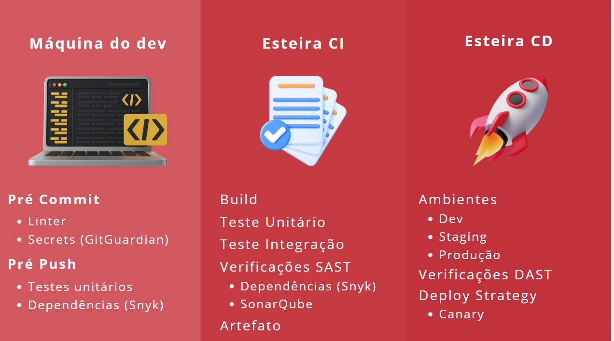
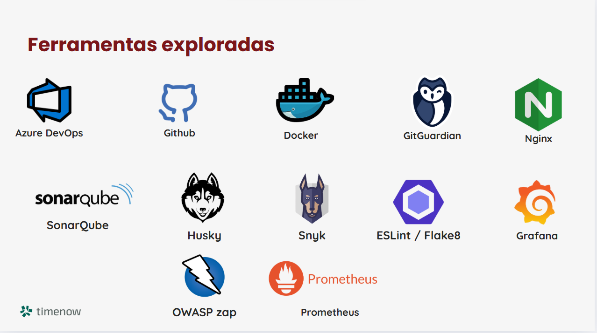

# Report Executivo 

&emsp;O report executivo tem como objetivo apresentar um relatório executivo consolidado, reunindo as principais métricas, indicadores e análises referentes ao desempenho operacional e estratégico da solução ao longo do período avaliado - 10 semanas. A estrutura do relatório foi organizada de forma a fornecer uma visão panorâmica e integrada das diferentes dimensões do projeto, com foco em suporte ao serviço, entrega contínua, desempenho analítico e controle de custos. O conteúdo está distribuído nas seguintes seções principais:

- Service Support: Apresenta dados sobre a gestão de incidentes, resolução de problemas e aderência aos SLAs (Service Level Agreements), refletindo a eficiência do suporte operacional.
- Service Delivery: Responsável pelos indicadores como NPS (Net Promoter Score), métricas de confiabilidade (SRE) e a saúde geral das aplicações, evidenciando a qualidade da entrega de serviço.
- AO - Analítico: Analisa o desempenho da operação sob a visão a de agilidade, produtividade e eficácia, com métricas como Lead Time, Cycle Time, TTM (Time to Market), vazão e gestão orientada a resultados (KRs).
- FinOps: Consolida os custos de infraestrutura em nuvem (Cloud), com foco em monitoramento de gastos e oportunidades de otimização financeira.

## Service Support

### Incidentes

&emsp;Como a construção da pipeline de CI/CD do projeto não subiu para produção, não temos relatos de incidentes reportados ou resolvidos. Entretanto, a construção da pipeline está totalmente sujeita ao suporte do Kino - ChatBot especializado da TimeNow. Entretanto, a construção de ambas pipelines tem como objetivo mitigar erros em lançamentos e implementações em produção de qualquer versão do Kino. Seja desde a construção do código, etapas de CI e a finalização na esteira CD. A iamgem a seguir mostra as ferramentas e tecnologias que nos auxiliaram nesse processo de construção da pipeline.

&emsp;Na máquina do dev, zelamos pela conformidade regulatóiria, proteção de dados e confiança do cliente. Em Esteira CI, redução de bugs em produção e menor custo de manutenção. E por último, esteira CD, que compõe entregas contínuas de valor ao cliente, menor tempo de resposta para correções de features e redução de riscos em produção.

**Ferramentas de apoio**

- Azure DevOps
&emsp;Plataforma da Microsoft para integração contínua (CI), entrega contínua (CD) e gerenciamento de ciclo de vida de aplicações, com suporte para repositórios, pipelines, testes e deploys.

- GitHub
&emsp;Hospedagem de código-fonte baseada em Git, com funcionalidades de versionamento, colaboração, GitHub Actions (CI/CD) e gerenciamento de projetos.

- Docker
&emsp;Ferramenta de containerização que permite empacotar aplicações e suas dependências em containers portáteis e reproduzíveis.

- GitGuardian
&emsp;Ferramenta de segurança que monitora repositórios (especialmente GitHub) para detectar exposições de segredos como chaves de API, senhas e tokens.

- Nginx
&emsp;Servidor web e proxy reverso de alto desempenho, frequentemente usado para balanceamento de carga, caching e segurança de aplicações web.

- SonarQube
&emsp;Plataforma de inspeção contínua da qualidade do código, que identifica bugs, vulnerabilidades e problemas de code smells em projetos de software.

- Husky
&emsp;Ferramenta usada para gerenciar git hooks (como pre-commit ou pre-push), muito útil para validar código antes de ser versionado.

- Snyk
&emsp;Ferramenta de segurança que detecta vulnerabilidades em dependências de projetos (open source) e sugere correções.

- ESLint / Flake8
&emsp;ESLint Linter para JavaScript/TypeScript que identifica problemas de estilo e bugs.
&emsp;Flake8: Ferramenta similar ao ESLint, mas voltada para código Python.

- Grafana
&emsp;Plataforma de visualização de métricas e logs, usada para monitoramento de sistemas e aplicações com dashboards interativos.

- OWASP ZAP (Zed Attack Proxy)
&emsp;Ferramenta de segurança open source para testes de penetração em aplicações web, mantida pela OWASP.

- Prometheus
&emsp;Sistema de monitoramento e alerta baseado em séries temporais, muito usado em conjunto com Grafana para métricas de performance e infraestrutura.

### Problemas

&emsp;Durante o desenvolvimento, alguns problemas recorrentes foram identificados e solucionados de forma iterativa:

- **Dificuldade inicial na configuração da pipeline CI/CD no GitLab**, especialmente no uso de runners personalizados.
- **Alto tempo de preparação de ambientes locais**, exigindo padronização posterior via containers.
- **Ausência de testes automatizados nas primeiras versões**, gerando retrabalho.
- **Falta de monitoramento e alertas nas primeiras execuções da pipeline**, dificultando a detecção proativa de falhas.

&emsp;Uma vez que essas configurações são bem feitas no início da preparação do ambiente de trabalho, retrabalhos e reajustes são minimizados, pois há todo momento estarão em análise na pipeline de CI e CD.

### SLA (Service Level Agreement)

&emsp;Atualmente, como a solução ainda está em fase de construção e não foi disponibilizada para produção, **não existem SLAs formalmente estabelecidos com usuários finais ou clientes**. No entanto, desde as primeiras etapas de desenvolvimento, a equipe buscou **antecipar os requisitos de qualidade e estabilidade** que futuramente resultarão os acordos de nível de serviço (SLA).

&emsp;A definição dos SLAs está sendo considerada principalmente nas seguintes dimensões:

- **Disponibilidade:** A construção da pipeline CI/CD visa garantir deploys mais seguros e estáveis, reduzindo o risco de indisponibilidade.
- **Tempo de Resposta para Correções:** O uso de esteiras automatizadas permite acelerar o ciclo de correções de bugs, contribuindo para um SLA mais agressivo no futuro.
- **Confiabilidade:** A padronização das etapas de desenvolvimento e entrega mitiga falhas, contribuindo para um tempo médio de recuperação (MTTR) mais baixo.

&emsp;Essas diretrizes já estão sendo implementadas para que, quando a solução for colocada em operação, os indicadores de SLA possam ser medidos, validados e acordados com clareza.

## Service Delivery

### NPS (Net Promoter Score)

&emsp;Como o projeto ainda está em fase de construção e **não há uma base de usuários finais utilizando o sistema em produção**, **não é possível mensurar o NPS neste momento**. No entanto, o time já considera estratégias de coleta de feedback contínuo para avaliar a satisfação dos usuários assim que a solução for disponibilizada.

&emsp;Entre os possíveis canais considerados estão:

- Integração de pesquisas automatizadas via Kino após interação.
- Coleta de avaliações internas com stakeholders envolvidos no desenvolvimento e testes.

&emsp;A definição antecipada dessas práticas visa permitir que o NPS seja acompanhado desde os primeiros ciclos de uso real. ALém disso, um bom feedback das interações do Kino apontam um bom funcionamento da cultura de desenvolvimenton de software e pipelines adotadas.

### SRE (Site Reliability Engineering)

&emsp;Embora a equipe ainda não opere sob um modelo completo de SRE, **alguns princípios fundamentais da Engenharia de Confiabilidade de Sites já estão sendo aplicados** na arquitetura e nos processos de entrega, com foco em:

- **Automação de deploys e testes via CI/CD**, reduzindo a possibilidade de falhas humanas.
- **Padronização de ambientes com containers**, garantindo previsibilidade e isolamento.
- **Prevenção de incidentes através da estruturação da pipeline**, incluindo validação e segurança em cada etapa.

&emsp;O objetivo é preparar a solução para que, em produção, métricas como **MTTR (tempo médio de recuperação)**, **change failure rate** e **disponibilidade** possam ser acompanhadas com precisão, garantindo **confiabilidade e escalabilidade**.

### Saúde das aplicações

&emsp;No momento, como a aplicação ainda não foi exposta em um ambiente de produção, não há **monitoramento ativo de métricas de saúde** como uptime, tempo de resposta ou logs de erro em produção.

&emsp;Porém, a arquitetura atual contempla:

- Criação futura de dashboards com ferramentas como Grafana.
- Integração com logs de build e execução para rastreamento de falhas na plataforma da Azure.
- Planejamento de alertas automatizados para comportamentos incorretos na plataforma da Azure.
- Testes ainda na máquina de desenvolvimento do desenvolvedor
- Testes durante a execução da pipeline em ambiente de Cloud - Azure.

&emsp;Essas iniciativas preparam o caminho para que a saúde da aplicação seja observada de forma contínua, garantindo estabilidade e performance após o go-live.

## AO – Analítico (Métricas de Desempenho)

Para compreender a eficiência e a produtividade do processo de entrega, adotamos métricas chave baseadas nos frameworks DORA e Accelerate já documentados no projeto. Abaixo estão os principais indicadores acompanhados e sua situação atual, com base nos dados coletados até o momento:

* **Lead Time / Cycle Time:** Representa o tempo entre a implementação de uma mudança e sua disponibilização em produção. Hoje, com a esteira CI/CD em fase inicial, o *lead time* médio de mudança é estimado em poucos minutos para o pipeline técnico (cerca de **3,2 minutos** para build e validações CI), acrescido do tempo de code review e aprovação. Em ambientes de homologação, o ciclo completo do commit até o deploy leva em torno de **horas**, ainda demandando aprovações manuais. Com a maturação do pipeline, espera-se reduzir significativamente esse tempo, permitindo que pequenas alterações cheguem ao usuário final dentro de **um dia ou menos**, aumentando nossa agilidade de entrega.

* **Vazão (Throughput):** Reflete a quantidade de entregas realizadas em determinado período. Como o projeto encontra-se em estágio de implantação da esteira, a frequência de deploys ainda é baixa (apenas **1 execução completa** registrada até o momento na pipeline CI/CD). Em sprints futuras, a meta é aumentar a vazão para entregas mais contínuas – por exemplo, **deploys semanais ou diários** em produção, conforme a confiança na automação cresce. A capacidade de entrega medida pelo Azure Boards (histórias/conclusões por sprint) indica uma velocidade inicial de \~**6 itens por sprint**, conforme registros do board, número que tende a subir conforme a equipe se adapta ao novo processo.

* **% de Horas em Evolução:** Este indicador monitora o percentual do esforço da equipe dedicado a novas funcionalidades (evolução) versus atividades de manutenção/correção. Nas primeiras sprints, praticamente **80%** do tempo do time foi alocado em evolução (implementação da própria esteira CI/CD e novas features), contra cerca de 20% em correções ou refatorações. Esse equilíbrio é saudável neste início, priorizando valor de negócio. A partir da estabilização do pipeline, espera-se manter um alto percentual de horas em evolução (>70%), dedicando uma parcela menor a dívida técnica e incidentes – o que indicará ganhos em qualidade do processo.

* **Gestão do Board e KRs:** Utilizamos o Azure Boards para gerir tarefas e user stories, vinculando-as aos objetivos-chave (OKRs) do projeto. Todos os itens do backlog estão associados a épicos e resultados-chave mensuráveis, o que nos permite rastrear o progresso de forma transparente. Até o momento, **100%** das entregas concluídas referenciam algum Key Result estabelecido no planejamento. A ferramenta analítica do Azure mostra, por exemplo, o **Lead Time médio por item de trabalho** e o **tempo médio em cada coluna do Kanban**, assegurando visibilidade sobre gargalos. A média de trabalho em progresso por membro foi de apenas **1 tarefa simultânea**, reforçando foco e fluxo contínuo. Essa clareza na gestão garante alinhamento entre as atividades do time e as metas estratégicas definidas.

* **TTM (Time to Market):** O tempo para disponibilizar uma nova funcionalidade ao mercado é um indicador crítico para a Timenow. Com a esteira automatizada, projetamos uma redução significativa no TTM – funcionalidades pequenas podem ir da concepção à produção dentro de **uma sprint**. No cenário atual, considerando desde o refinamento do requisito até o deploy em produção, nosso *Time to Market* típico para uma melhoria é de aproximadamente **2 a 4 semanas**. A meta, com DevOps e integração contínua, é reduzir esse intervalo em pelo menos **30%**, acelerando entregas sem comprometer a qualidade. Essa melhoria permitirá responder mais rápido às demandas do cliente e mudanças de mercado.

* **Produtividade da Equipe:** A produtividade está sendo acompanhada tanto por métricas de software quanto por indicadores de processo. Do lado técnico, a *taxa de sucesso da pipeline* é de **100%** até o momento (nenhuma falha nas execuções de build/testes), demonstrando estabilidade nas entregas automatizadas – o que poupa retrabalho e aumenta a produtividade. Do lado do processo, a *velocidade média* do time foi calculada em **\~6 pontos por sprint** (valor inicial de referência), com tendência de crescimento à medida que bloqueios forem removidos. Além disso, o gráfico de *burndown* das sprints indica que a equipe tem conseguido concluir cerca de **90%** do escopo planejado dentro da iteração, sinalizando boa capacidade de entrega. Com a adoção das práticas de CI/CD, espera-se um ganho de produtividade estimado em **15-20%**, seja pelo feedback mais rápido (pipelines de 3 minutos agilizando detecção de erros), seja pela redução de tarefas manuais (deploys e testes automatizados liberando tempo dos desenvolvedores para atividades de valor agregado). Em resumo, os dados analíticos iniciais apontam uma evolução positiva na eficiência do time, embasando decisões de melhoria contínua nos próximos ciclos.

## FinOps – Custos Cloud (Estimativa e Otimização)

Nesta seção avaliam-se os custos relacionados à infraestrutura cloud utilizada no projeto, adotando a ótica de FinOps – ou seja, buscando **transparência e otimização de gastos**. Como a solução ainda não entrou em produção, não há dados reais de consumo; portanto, fizemos estimativas realistas dos recursos utilizados na esteira CI/CD e seus custos mensais previstos, com base nos preços atuais dos serviços em nuvem. Os principais componentes e custos estimados são:

* **Azure DevOps Pipelines:** O uso do Azure Pipelines para CI/CD possui um modelo de cobrança por agente (job) de build. A boa notícia é que nosso volume de pipelines se mantém dentro da franquia gratuita oferecida pela Microsoft – atualmente é disponibilizado **1 agente hospedado na nuvem com 1.800 minutos/mês sem custo**. Caso o projeto escalasse além disso, cada agente adicional custaria cerca de **US\$ 40 mensais**. No cenário atual, não há custo direto pelo uso das pipelines, já que nosso consumo (\~**750 minutos/mês** estimados) fica abaixo do limite. Optamos por agentes Microsoft-hosted para evitar custos de infraestrutura própria, e não há, até o momento, necessidade de *parallel jobs* extras. Além disso, o Azure Repos e Boards são gratuitos para equipes de até 5 usuários – a Timenow usufrui de **5 usuários gratuitos** no plano Basic do Azure DevOps, com cada usuário adicional custando **US\$ 6/mês** caso o time cresça. Desse modo, a plataforma DevOps em si tem custo marginal zero atualmente, dentro do pacote contratado pela empresa.

* **Infraestrutura de VM (Máquinas Virtuais):** Para componentes de suporte da esteira, utilizamos instâncias em nuvem de pequeno porte, visando minimizar gastos. Exemplos incluem a VM Linux que hospeda o SonarQube (análise de código) e a VM usada no ambiente de *canary release* (rodando containers do aplicativo e do Nginx de balanceamento). Escolhemos instâncias do tipo **Standard B2s** (2 vCPUs, 4 GB RAM) que são econômicas – custam em torno de **US\$ 30 a US\$ 40 por mês cada** em regime pay-as-you-go. Assim, duas VMs desse porte totalizariam aproximadamente **US\$ 60-80 mensais** (cerca de R\$ 300-400). Essas VMs cobrem nossos ambientes de teste/homologação sem onerar significativamente o orçamento. Vale destacar que, em produção, poderíamos desativar VMs fora de horas de pico ou adotar instâncias reservadas para reduzir custos em até \~70%. Por ora, considerando a carga leve (uso eventual para validações), o gasto permanece controlado.

* **Azure Container Registry (ACR):** O registro de imagens container na nuvem é essencial para versionar e distribuir o artefato Docker da aplicação Kino. O tier **Basic** do ACR, adequado para nosso caso, tem custo de aproximadamente **US\$ 0,25 por dia** para até 10 GB de armazenamento – equivalente a \~**US\$ 7,50 ao mês**. Esse valor inclui 2 webhooks e já comporta nossas imagens do backend sem necessidade de upgrade de plano. No entanto, observamos que atualmente utilizamos o Docker Hub (plano gratuito) para armazenar a imagem do protótipo, o que elimina esse custo no curto prazo. Para a fase de produção, migrar para o ACR interno traria integrações nativas com Azure ao custo citado (ex.: \~R\$ 40 mensais), o que é relativamente baixo. De todo modo, manter o repositório de containers enxuto – apagando imagens antigas e limitando a retenção – evitará cobranças extras (o ACR oferece 10 GB grátis e cobra cerca de **US\$ 0,10 por GB adicional ao mês**, uma tarifa bastante acessível).

* **Armazenamento de Artefatos e Logs:** Além das imagens Docker, a esteira gera arquivos de configuração e logs de deploy. O Azure Artifacts oferece **2 GiB gratuitos** para pacotes e artefatos, excedidos os quais há cobrança de **US\$ 2 por GiB** armazenado. Até agora, nosso uso de artefatos (por exemplo, o arquivo **nginx.conf** gerado para configurar o canary) é mínimo – poucos megabytes – então não há custo significativo. Os logs das pipelines são mantidos por 30 dias nos agentes sem custo direto. Em produção, caso integremos o Azure Monitor/Application Insights para telemetria das aplicações, teremos custos de log e métricas (\~**US\$ 2,30 por GB de dados ingeridos**, segundo tabela Azure). No entanto, dada a escala modesta do Kino, estimamos menos de 1 GB/mês de telemetria inicialmente, ou seja, \~**US\$ 2-3 mensais** se habilitado. Esse monitoramento é valioso para SRE e justifica o investimento, mas será otimizado com amostragem de logs e retenção adequada para ficar dentro de orçamento.

* **Azure Key Vault:** Os segredos (chaves, senhas) utilizados no pipeline ficam armazenados com segurança no Azure Key Vault (tier Standard). A precificação é feita por transações de acesso aos segredos, a **US\$ 0,03 a cada 10.000 operações**. Nosso pipeline realiza poucas operações de vault por execução (por exemplo, obter tokens de acesso), totalizando talvez algumas centenas de operações mensais – custo inferior a **US\$ 0,01**! Ou seja, o uso do Key Vault é praticamente **irrelevante em termos de custo**, mas de enorme benefício em segurança. Mesmo com aumento de uso, dificilmente ultrapassaríamos alguns dólares por mês nesse serviço. Mantemos política de cache de segredos quando possível, para reduzir chamadas desnecessárias, embora o custo seja baixo.

**Totalizando os custos estimados**, a operação atual da esteira CI/CD implica um gasto na faixa de **US\$ \~100 por mês** (cerca de R\$ 500) distribuído entre nuvem Azure e serviços associados. Esse valor cobre toda a infraestrutura de automação e ambientes de teste, sendo extremamente competitivo frente aos benefícios obtidos (maior qualidade e rapidez nas entregas). Para a Timenow, significa viabilizar DevOps com investimento modesto.

Do ponto de vista de *FinOps*, é importante notar que todos os componentes estão sendo monitorados e há estratégias de otimização prontas para entrar em ação conforme necessário: por exemplo, **aproveitar os tiers gratuitos** (como já fazemos com pipelines e Docker Hub), **limitar recursos ociosos** (desligar VMs fora do horário comercial), **limpar artefatos antigos** para economizar armazenamento, e eventualmente avaliar alternativas de menor custo (como usar repositórios de container terceiros, e.g. Docker Hub, que possui plano gratuito com 1 repositório privado). Além disso, configuraremos alertas de custo no Azure Cost Management para qualquer anomalia de consumo, assegurando governança financeira. Em suma, a arquitetura proposta não só é eficiente tecnicamente, como também **financeiramente sustentável**, alinhada às práticas de FinOps ao maximizar o valor entregue por real investido e evitar desperdícios desde o início do projeto.
